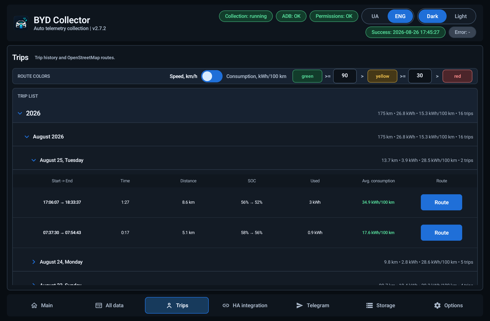
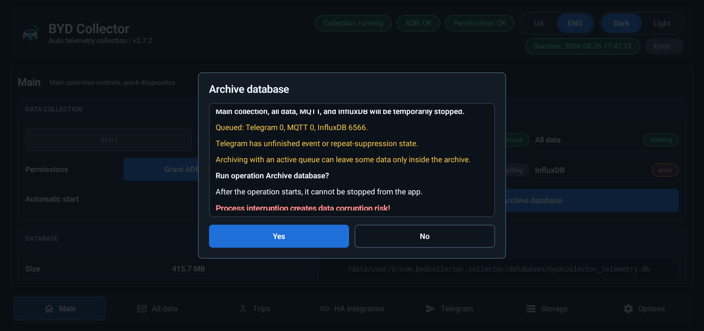
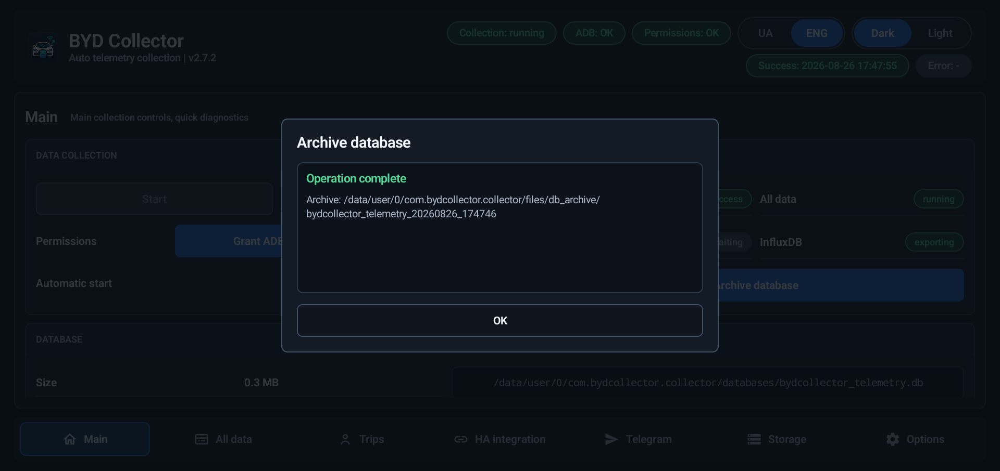

# BYD Collector

**English** | [Українська](README.uk.md)

BYD Collector is a read-only telemetry collector for Chinese-market BYD vehicles using DiLink 5.0. It reads vehicle values through the local Android ADB bridge and an APK-owned `app_process` helper, keeps the raw readings in SQLite, derives a normalized vehicle state, and optionally exports that state to MQTT/Home Assistant, InfluxDB, and Telegram.

- **Vehicle focus:** Chinese-market BYD Sea Lion 07 EV
- **Current source/local APK:** `v2.7.9`; latest published release: `v2.7.8` (verified on 2026-09-03)
- **Package:** `com.bydcollector.collector`
- **Download:** [latest GitHub release](https://github.com/sunlixWhyNotAvailable/byd-collector/releases/latest)
- **Help:** read [Troubleshooting](#troubleshooting), then [Report a problem](#report-a-problem)

> **AI disclosure:** Generative AI tools are used in this project for code and diagnostic-log analysis, implementation, testing, and documentation.

The collector is an engineering and research tool, not an OEM diagnostic or safety system. It never sends vehicle-control commands.

## How collection works

The production path is deliberately local and read-only:

1. The Android app checks the local ADB bridge and starts the packaged helper with the app's class path.
2. The helper uses only the approved getter transactions (`5` and `7`) and a fixed read whitelist.
3. Each poll preserves the raw value, field name, Chinese name/description when available, quality, elapsed time, stale/failure state, and partial-success metadata in SQLite.
4. Normalized fields are derived from the raw record for the UI and integrations. Unknown fields and values remain queryable; enum meanings are field-specific rather than globally assumed.

The UI keeps the latest dashboard snapshot in a process-wide cache. Opening or resuming the app and switching tabs therefore renders the last known state immediately, while scoped background refreshes replace only data that can actually change. KPI values and row-count deltas are fed directly from successful collection/storage work; SQLite full counts are used only to establish or rebuild a baseline after startup or database maintenance.

The selected tab, each tab's scroll position, and expanded Trips groups belong to the live app session. They survive tab changes, backgrounding, and Android recreating the window while the process remains alive. Ready content opens at its retained position from the first layout, without a delayed scroll jump. Loading placeholders do not reset retained positions. Shutdown or a new process starts from the initial navigation state; ordinary collector/export Stop does not reset it. Navigation is not saved to disk.

Interactive controls do not add an artificial callback delay: accepted button, switch, selector, category-chip, icon-button, and bottom-tab actions run immediately. The shared 100 ms pressed animation is visual feedback and repeat protection only. Asynchronous work disables only the affected operation; Main, All data, MQTT, and InfluxDB expose stopped, starting, running, stopping, or error states, and an older completion cannot overwrite a newer Start/Stop intent. Single-line text fields commit their current value and clear focus when the keyboard Done action is pressed or the keyboard is dismissed; multiline Telegram templates keep Enter/newlines.

## Features

| Area | What it provides |
| --- | --- |
| Read-only transport | Local ADB plus an APK-owned read-only `app_process` helper with a fixed read whitelist |
| Main tab | Start/stop the curated 82-field read-only poll, automatic start, current status, database health, and quick diagnostics |
| All data tab | Round-robin research polling of the full 23,096-signature catalog, with raw values and change/transition evidence |
| Normalized state | SOC, SOH, range, odometer, battery energy, charging, power, temperatures, doors, tires, climate, speed, radar, and related vehicle fields |
| MQTT / Home Assistant | Home Assistant MQTT Discovery and live current-state topics for selected categories, with primary/optional alternative endpoints and sticky transport failover |
| InfluxDB | Independent `InfluxDB v1` historical export with durable cursors, sticky primary/alternative routing, and retry state |
| Telegram | Optional outbound event messages with editable templates and a dedicated archive-safe SQLite FIFO outbox |
| Trips | Separate local trip history, GPS routes, lossless compression for completed routes, configurable speed/consumption colours, and an online OpenStreetMap view |
| SQLite and archives | Compact SQLite stores for raw, normalized, and Trips data, crash-safe database cutover, ZIP archives, sharing, and a shared archive limit |
| Runtime | Background recovery, optional Tailscale activation, combined Wi-Fi/cellular recovery, Bluetooth recovery, and explicit shutdown |
| Diagnostics | An always-on bounded operational journal, optional full-system logcat under `Options -> Keep alive`, fresh native ZIP sharing, and safe log cleanup |

The app UI is available in English and Ukrainian and supports dark and light themes.

## Main tab

`Main` controls the production poll. Start it after ADB is authorized, or enable its automatic-start switch for supported boot and runtime events.

- The curated main catalog contains 82 direct fields, including the read-only power-boundary candidate.
- The app owns the normal 500 ms Main poll and authoritative SQLite writer. A detached helper starts fallback reads only after the app lease has been absent for two seconds, writes crash-safe records without opening Android SQLite, and leaves the app to validate and idempotently import them before its next live read. Intentional Main Stop/Shutdown or full database maintenance stops the helper; ordinary app-process loss leaves it collecting until app recovery or kernel reboot.
- Integer and float values use grouped native reads where possible, with ordered results and an in-helper scalar fallback.
- The status card shows polling, MQTT, and InfluxDB states, last success, last error, and session errors.
- The normalized vehicle-state cards show current SOC, SOH, odometer, cabin and battery temperatures, charging/discharging, range, cell-voltage delta, and category summaries.
- Main raw polls remain authoritative. Normalized history is lossless and currently has no automatic retention period or downsampling.

Raw `CHARGING_STATE` remains queryable in Main data, but its constant/untrusted normalized field is retired from active exports and Telegram semantics; charging evidence uses the connected charge gun and positive battery charge power only. `max_discharge_power_allow_raw` remains visible as the exact unitless raw number with no inferred kW scale. `bodywork_sunroof_windoblind_position` preserves observed integer codes `0`, `1`, `2`, and `4` instead of collapsing them to a boolean; Home Assistant migrates from the old binary-sensor discovery to the unitless sensor.

Use `Stop` before maintenance or when the car should no longer be polled. A failed or incomplete poll is recorded as such; the UI does not silently turn an unknown value into a valid one.

## All data tab

`All data` is the research/debug lane. It can be started independently after the main runtime is available.

- The full catalog currently contains 23,096 read-only signatures.
- A round-robin cycle sends the catalog as one helper request on the existing 500 ms cadence; it is not split into arbitrary 10,000-entry runtime steps.
- Raw values, descriptions, quality, and transition/change evidence are stored in the separate round-robin database.
- This lane is useful for discovering changing fields. A changing value is not, by itself, a confirmed field meaning; promote fields only with field-specific evidence.

Round-robin storage is cut over and checked before a debug session starts. Stopping the lane does not change the main poll.

## Trips and routes

The `Trips` tab stores power-on to confirmed-power-off sessions in a separate app-private `bydcollector_trips.db`. It keeps only trip summaries and GPS route points/gaps; it does not duplicate the full Main telemetry catalogue. Zero-motion sessions remain stored but are hidden from the ordinary list.

Route recording uses Android's GPS provider after the user grants location access. During serialized first-run setup, the app requests fine/coarse location once before the ADB authorization step; after a denial, access must be granted later in Android settings. Mock, stale, clock-skewed, physically impossible, or otherwise untrusted fixes with finite coordinates remain in `route_points` as diagnostics but are excluded from the trusted route; numerically invalid coordinates are stored as gaps. When a live vehicle-speed sample from the last two seconds is available, a GPS fix is also rejected if its reported or adjacent-fix implied speed exceeds vehicle speed by more than `40 km/h`; replayed fallback telemetry cannot supply that reference. Missing or stale vehicle speed leaves the existing GPS checks unchanged. After a rejection, callback outage, or location-source restart, three mutually consistent fresh fixes are required before location is trusted again. The map uses online OpenStreetMap tiles, fits the trusted route, and can colour segments by speed or instantaneous consumption. Trusted route runs use a black outline for contrast; every rejected fix interrupts the rendered line instead of being bridged. Gray consumption sections mean that an instantaneous-consumption value is unavailable, not that consumption is average or zero. A compact blue dot marks Start; a neutral circle with a white flag marks Finish, with matching localized Start, Finish, and No data legends in the lower control row. Defaults are speed colouring with `90/30 km/h` thresholds and consumption thresholds of `15/20 kWh/100 km`.

Completed Trips routes can be compressed losslessly from the Trips tab. The operation keeps every trip, point, value, order, gap, and map; the open trip stays writable and is not split. Its initial closed/checkpointed snapshot briefly pauses Trips persistence while receipt-timestamped callbacks queue; GPS collection is not paused. It verifies a replacement before publication and keeps the original if preparation or verification fails. Committed data is not rolled back; cleanup can leave temporary files, but it does not remove the written history. It is not an archive, JSON export, retention rotation, or `VACUUM` operation; no automatic deletion or rotation is enabled.

## MQTT, Home Assistant, and InfluxDB

The `HA integration` tab configures the two off-car export channels. They are independent: a problem with one channel does not make a successful main poll fail. For either channel, profile selection, both endpoint drafts, and shared connection fields lock from accepted Start/resume through completed Stop, including retry and failover; Stop remains available. `Test connection` checks only the selected profile and never changes the running route.

### MQTT and Home Assistant

- Publishes Home Assistant MQTT Discovery configuration and live normalized vehicle state.
- Select battery, motion, body, climate, safety, and location from the ordinary category grid.
- The location category remains off by default. When enabled, it publishes the latest trusted normalized GPS state; local trip/location recording remains independent of export selection.
- Configure a Primary host/port and an optional Alternative host/port for the same broker, plus shared username/password, client ID, topic prefix, and discovery prefix.
- MQTT is for current state. A disconnected Home Assistant broker can mean that a live state is missed; SQLite remains the local source of truth.
- A failed publish becomes eligible again after 30 seconds. The runtime schedules one persisted single-flight retry at that deadline without waiting for a new state update or status heartbeat.
- Labels distinguish the edited profile from the route currently in use.
- A new connection cycle tries Primary first. Connect or publish transport failures close the failed client and try the other profile once; a working route is reused until the next connection cycle. Authentication, TLS, and data failures are reported without rerouting.

### InfluxDB

- Exports normalized history to `InfluxDB v1` for long-term charts and Grafana.
- Configure a Primary host/port and an optional Alternative host/port for the same database, plus shared database, measurement, credentials, and categories independently of MQTT.
- The location category remains off by default. When enabled, timestamped trusted GPS history uses the same durable per-field cursor contract as the other categories.
- A persisted cursor is kept for each selected field. Export is independent of main polling while the service is alive: globally ordered batches contain up to 300 rows below 5,000 pending rows and up to 2,000 rows from that threshold. Transient failures step a large batch down through 1,000, 500, and 300 rows before later successes ramp it back up. A proven single malformed/type-conflicting row is isolated without deleting its raw history or blocking unrelated fields; generic authentication/configuration failures are not treated as bad data. Successful batches continue once per second while backlog remains, and a real write failure uses a 30-second retry delay. The successful endpoint remains sticky across requests and batches; after Stop/start or both endpoints fail, the next cycle begins at Primary. Fallback is limited to network/timeout and HTTP 502/503/504; 429, authentication, TLS, protocol, and data errors keep the current route. HTTP 400 line-format isolation stays pinned to the endpoint that rejected that batch.

Transport security and TLS deployment are separate integration decisions. Protect the endpoint and credentials on the network where the collector is used.

## Telegram notifications

Telegram is optional and disabled by default. It sends plain text through the Telegram Bot API only; the collector does not accept commands, register webhooks, poll updates, or send media.

Configure the bot token, chat ID, event switches, delay values, and message templates in the `Telegram` tab. Secrets are stored with the Android Keystore, shown masked by default, and can be cleared explicitly.

New or unset low-12 V thresholds default to `12.5 V` in `0.1 V` steps; existing saved thresholds and custom template text are preserved. Charging start/progress/stop defaults include the local event time (`dd.MM.yyyy HH:mm`); progress shows Power directly below Charge and retains step/session energy and duration.

The Trip summary header warns immediately when the source template exceeds Telegram's 4,096-character limit; expansion and location-link overflow states update from the actual runtime render. If the template itself fits but selected location links cause the overflow, the header uses the complete dedicated `Template exceeds the 4,096-character limit with location` warning rather than an appended suffix.

Supported event templates include:

- charging started, charging progress, charged to 100%, and charging stopped;
- charge-gun connected and disconnected;
- low 12 V voltage;
- telemetry unavailable; and
- trip summary.

Charging-progress templates can report energy/SOC and localized duration for both the current step and the whole charging session. The built-in charged-to-100% report also shows added SOC/energy and the observed charging start, end, and duration. Charging baselines persist across process or kernel recovery; a cold attachment starts from the first observed active-charging sample. The editor presents nine equal-height cards; each editor scrolls internally after seven lines, and the variable picker scrolls independently. Charging templates distinguish `Current energy used` from `Total energy used`. Recognized current and historic built-ins follow the persisted app language, while custom templates retain their exact text. The one-time trip-summary migration updates only a recognized persisted built-in; custom text and saved settings remain exact. Trip summaries separate the current `P -> non-P -> P` trip from totals observed during the current vehicle power session. The built-in current and overall energy rows calculate their own average consumption from the matching energy and distance totals; custom templates can use the separate `{trip_avg_kwh_per_100km}` and `{total_avg_kwh_per_100km}` variables. Current-trip SOC is frozen at the confirmed end of that drive; Overall SOC starts with the first drive and continues through the latest observed session SOC, including parked consumption between drives. That baseline survives delayed-`P` finalization and process recovery and clears with the power-session totals at confirmed power-off. Recognized previous built-ins migrate to the corrected variables, while custom templates remain exact. When the built-in summary's Overall distance, energy, duration, and SOC are display-identical to its only completed trip, that duplicate block is omitted; a parked SOC change or distinct multi-stop total remains visible. A summary is eligible for an SOC change of at least 1%; otherwise the trip must exceed 0.1 km or 0.1 kWh. A short `P` below the configured delay remains part of the same trip; once that deadline expires, the old trip is finalized before a new drive can replace it. After process recovery, the original parked deadline remains in force; recovery finalizes the trip before fresh telemetry only when that deadline has expired. If the first observed gear is missing, tracking starts from the subsequently confirmed driving gear without inventing earlier distance or energy. The first valid power-off sample bypasses the parked delay and durably queues and immediately attempts the summary while the network may still be available.

Trip-summary location is off by default. The separate `Send location` action has a centered `No` / `Yes, N links` status and opens a blocking modal with independent Google, Waze, Apple, and OSM selections; choosing zero links is allowed. At real power-off, the summary receives only the selected navigation links in that order, without separate coordinate, capture-time, or age rows. The latest trusted valid point from the same trip/power session remains eligible when the current fix is absent or invalid; no extra age cutoff or earlier-trip fallback is applied. A trip finalized by the configured long-`P` delay is sent without links. If no qualifying final summary replaces it at power-off, that earlier trip records its Telegram obligation durably before the trip is closed, even if its summary is still undelivered; after the matching summary is durably acknowledged, exactly one links-only follow-up is sent. Before power-off, starting a later short drive in the same power session preserves the earlier pending location. At power-off, a qualifying new final summary carries the selected links once and settles that earlier obligation without a second links-only message. If the final drive is too short for a summary, the earlier follow-up is retained. Queued follow-ups survive process restarts; a missing/pruned row or another trip never proves delivery. Disabled location, no selected navigator, or no trusted point recorded during that trip clears the follow-up without blocking the summary. The collector does not upload a route image or other media.

The outbox keeps FIFO order among unblocked ordinary events. Retryable failures retain their backoff; permanently blocked rows remain for diagnosis but do not hold later messages. A summary finalized by the first valid power-off sample is attempted immediately after its durable commit, and a pending summary receives one priority attempt when the enabled Telegram runtime starts. Other events keep ordinary unblocked FIFO order. Successful delivery schedules the next eligible row immediately without a fixed pacing delay. Telemetry-unavailable timing is rebased when the Telegram runtime is enabled, so a kernel/process restart or later enable does not immediately replay an outage from stale timestamps. Trip-summary delay is configurable from 5 to 300 seconds (10 seconds by default).

The outbox and its single runtime-state row live in the separate app-private `bydcollector_telegram.db`, so Main or Debug/test archive maintenance cannot replace queued messages or in-progress event state. A one-time validated transaction imports legacy Main Telegram rows before the Telegram runtime starts; a failed import disables only Telegram, reports a storage error, and leaves manual Main recovery available. A persistent fail-closed marker prevents a fresh Main database from being mistaken for a successful migration after an interrupted or failed archive; unresolved legacy Telegram rows remain in the preserved Main archive until explicitly recovered. Malformed live sidecar state or a runtime sidecar SQLite failure also closes and gates only Telegram with the red storage status; Bot API/network errors remain ordinary transport failures. The sidecar keeps at most 1,000 pending rows, prunes only previously attempted rows after 30 days, deletes delivered rows, and relies on normal SQLite page reuse without vehicle-side `VACUUM`. It is not included in Main/Debug archives, diagnostic ZIPs, or `Clear logs`.

## Storage and archives

SQLite is the authoritative long-term store. JSON is used for export/transport, not as the primary database.

- Fresh installations use compact Main, Debug/test, and Trips SQLite schemas.
- Raw readings are retained before normalization; normalized current state and history use compact identifiers and quality codes while preserving queryability.
- Existing Main and Debug/test databases are archived before format cutover; they are not migrated in place or deleted as part of that transition. Trips schema upgrades are additive and preserve its history.
- Main cutover is automatic only when MQTT and all InfluxDB cursors have no queued work. During the one-time upgrade, any not-yet-migrated legacy Telegram queue or unfinished legacy event state also defers cutover until it is safely copied into the dedicated sidecar.
- Automatic startup cutover remains fail-closed on format, checkpoint, integrity, or recovery uncertainty. Explicit Main and Debug/test archive actions are recovery overrides: inspection failures are preserved as warnings instead of disabling the user's only in-app reset path. Both lanes still use exact SQLite sidecar sets, crash journals, and rollback boundaries; a manual archive stops if the source set cannot be preserved without overwrite/data loss or if a fresh writable database cannot be created and verified.
- The `Storage` tab shows active Main + Debug/test + Trips totals and a `+` breakdown, archive size/count, sort order, and the configured shared archive limit. Totals include each database's SQLite `-wal`, `-shm`, and `-journal` companion files. The archive-root path stays in the shortened monospace field; the existing Share icon is shown with the localized `Поділитись` / `Share` label. It can share selected ZIP archives or delete selected archives after confirmation.
- Confirmed deletion publishes `0 / N` immediately, retires selected rows from the visible list before worker completion, verifies each target, continues through partial failures, and reconciles the final snapshot. Manual deletion affects only the selected archives; automatic retention remains a separate oldest-first process with newest-per-family protection.
- The limit applies to completed Main/Debug archives; Trips has no archive family. Main and Trips histories remain unbounded. Completed Trips routes can be compressed losslessly from the Trips tab; no automatic deletion or rotation is enabled.

Archive maintenance can temporarily stop collection and integrations. Read the confirmation dialog: it shows queued Main-owned MQTT/InfluxDB work, reports a Telegram migration warning separately when applicable, and warns when an operation cannot be stopped safely after it begins. The live Telegram sidecar itself is not at risk from Main archive replacement.

  
  

## Options and runtime

The `Options` tab contains operational controls rather than vehicle-control commands:

- switch English/Ukrainian and dark/light themes;
- grant or re-check ADB access and open the DiLink background-app settings;
- enable automatic start for main collection, All data, MQTT, and InfluxDB where shown;
- restore Wi-Fi and cellular together, or Bluetooth independently, while the runtime is active;
- restore the collector service after supported process/boot events;
- start or stop the single full-system logcat recorder, then create a fresh diagnostic ZIP or clear local logs at the bottom of `Keep alive`;
- grant and verify the notification-listener lifecycle anchor through the app's local-ADB repair flow; the service reads no notification payloads;
- keep Wi-Fi and cellular enabled from the separate detached keep-alive helper every 30 seconds when their combined switch is enabled;
- optionally detect and activate Tailscale when a configured endpoint is unreachable, with a delayed launch and foreground-task restoration; and
- check for a verified update, or use `Shutdown` to stop runtime until the app is opened again.

The app's keep-alive path is recovery-oriented and idempotent. It does not write vehicle values or invoke vehicle-control APIs.

Automatic update checking starts a 30-second countdown with the app process,
including background startup. Requests start and update prompts appear only
when the app is in the foreground. Returning after a normal background stop uses the
remaining delay, or checks immediately if it has elapsed. An available update
survives window recreation. Closing its offer pauses automatic checks for one
hour; a new app session can reset that pause earlier. There is no hourly
background polling, and the manual check remains available. Each check asks for
the latest published release; a failed check does not impose an extra cooldown.

## Diagnostics and privacy

There is no separate `Logs` tab or user-controlled Journal mode. The app continuously writes existing operational events—not telemetry samples—to an app-private JSONL journal with one active file plus three 2 MiB rotations (8 MiB maximum). Start and stop the optional full-system logcat recorder at the bottom of `Options -> Keep alive` when investigating a reproducible issue. Start waits for the completed ADB authorization check and uses the exact command `logcat -b all -v threadtime`; it does not silently fall back to a PID-filtered app-only file. Full-system capture is capped at eight 16 MiB segments (128 MiB total).

Each `Share logs` action creates a new coherent snapshot rather than modifying an old logcat run. The ZIP contains capture metadata, the bounded JSONL journal, up to 200 recent SQLite `collector_events`, provenance plus a best-effort copy of the active or latest logcat run, up to the last 512 KiB of `/data/local/tmp/bydcollector_keepalive.log`, and a bounded 64 KiB redacted `trips_telegram_evidence.txt` sidecar. The sidecar contains hashed trip/dedupe/dependency references, route continuity/final-point quality, and bounded Telegram outbox/runtime metadata; it contains no coordinates, message payloads, credentials, URLs, or database copies. Missing logcat/helper data is recorded as a controlled status entry and does not block the ZIP. Main, Debug, Trips, and Telegram databases are not included. Before snapshot/copy/ZIP work, Share requires free space for four times the retained source plus 16 MiB; insufficient space or ZIP failure preserves the source capture and the last valid bundle. Android receives only the ZIP attachment—no prefilled subject or message—and opens the native chooser with an immutable cache copy.

`Clear logs` first opens a localized blocking confirmation over the still-visible Options screen. Confirmation removes completed captures and generated bundles, resets the JSONL journal, and attempts to truncate the helper log in place without interrupting an active logcat capture. A helper/ADB failure is reported as partial cleanup instead of blocking local cleanup. A fresh handoff copy remains protected for 10 minutes so the receiving app can finish reading it; expired copies are pruned by the next Share/Clear action and can otherwise remain until Android clears app cache. Recorder, snapshot, ZIP, share preparation, and cleanup work runs away from the UI thread.

Influx diagnostics record why an export cycle is skipped, retry and worker state, the profile/host/port used by Test and export, request stages/results, and server acknowledgement separately from cursor persistence. They do not log telemetry payloads or change retry timing. Share also includes `influx_evidence.txt`: at most 128 KiB of configured/runtime state, cursor metadata and the latest 200 export events, with explicit truncation/availability status. Database evidence is read-only; maintenance contention produces a partial snapshot rather than waiting for maintenance or initializing a database.

Before ZIP creation, only the temporary Share copies are filtered for recognized credential/header values, URL credentials, explicit coordinates and private VIN/chat/account fields. The same private identifier receives the same alias within that bundle. App and firmware versions, vehicle names, hosts/IP addresses, ports and technical IDs remain readable. Malformed or oversized records are omitted with a `privacy_status.txt` entry, while other complete JSONL records survive. Original recordings, database archives and integration payloads are unchanged; this is not a guarantee that arbitrary full-system logcat is anonymous.

Diagnostics stay local unless you explicitly share the ZIP through the Android chooser. Operational details, full-system logcat, and helper output can still contain private addresses, identifiers, coordinates, or unrelated process data. Review the archive before sharing it and do not publish credentials or sensitive location data. Database archives are a separate Storage feature and can contain raw telemetry and trip history.

The collector does not automatically upload telemetry, screenshots, crash reports, or logcat to the project. MQTT, InfluxDB, and Telegram are opt-in destinations configured by the user. Read the complete data-handling policy in [PRIVACY.md](PRIVACY.md).

## Installation and ADB

### Requirements

- Android 8.0 (API 26) or newer;
- a compatible Chinese-market BYD vehicle with DiLink 5.0;
- permission to install APK files on the vehicle tablet; and
- local ADB access to the vehicle tablet.

### First setup

1. Download the current APK from [GitHub Releases](https://github.com/sunlixWhyNotAvailable/byd-collector/releases/latest) and verify the release checksum when one is published.
2. Install and open **BYD Collector** on the vehicle tablet.
3. Follow the first-run background-app prompt and set `Disable background Apps -> BYD Collector` to `OFF`.
4. Accept the one-time Android fine/coarse location request if route recording is wanted. After a denial, grant it later in Android settings; the app does not repeatedly prompt.
5. When Android shows the ADB RSA prompt, confirm it. In the app, use `Grant ADB` to re-check the bridge.
6. Start `Main` and confirm that the status changes from waiting to successful polling.
7. Enable the default-off `location` category only for MQTT/Influx channels that need precise-location export.
8. Enable only the integrations and Telegram events you need, then test each connection from its tab.
9. Start `All data` only for research sessions; it writes a separate, much larger database.

ADB is required for direct vehicle reads and for the helper startup. Without an authorized bridge the app can still open and show stored data, settings, and archives, but it cannot collect fresh vehicle telemetry. Re-authorize after a tablet reset, Android security prompt, or changed host key.

## Troubleshooting

### Main stays in `waiting` or reports `ADB`/permission errors

- Confirm the tablet is awake and the local ADB bridge is authorized.
- Press `Grant ADB` and accept the RSA prompt again if Android asks.
- Set `Disable background Apps -> BYD Collector` to `OFF`.
- Stop another copy of the collector or an app that may own the local ADB session, then start Main again.
- Start logcat under `Options -> Keep alive`, reproduce the issue, then stop it to finish the diagnostic bundle.

### Main is successful but a value is blank, stale, or unknown

This can be a vehicle-side unavailable field, an incomplete helper response, or a field without a confirmed mapping. The raw value and quality metadata remain queryable. Do not infer a global enum meaning from one field or one driving session.

### All data is slow or storage grows quickly

All data intentionally polls the research catalog and stores raw evidence. Stop it when the session is complete, then use the All data tab's `Archive database` action; `Storage` is for sharing or deleting existing archives. Share only the affected archive when reporting a discovery.

### Home Assistant or MQTT is offline

Check the selected profile's broker host/port, shared credentials, topic/discovery prefixes, and categories. `Test connection` checks only that profile. During a runtime cycle, transport failures try the other configured profile once; authentication, TLS, and data failures do not switch routes. MQTT publishes current state only; historical gaps are expected while the broker is unreachable. Main collection and SQLite continue independently.

### InfluxDB is behind or shows retries

Check the selected profile's endpoint, shared credentials, database/measurement, and category selection. The successful endpoint stays sticky across requests and batches; a fresh cycle starts at Primary. Fallback is limited to network/timeout and HTTP 502/503/504, while 429, authentication, TLS, protocol, and data failures stay on the current route. The exporter retains cursors, uses 300-row batches below 5,000 pending rows and up to 2,000 rows from that threshold, adapts large batches downward after transient failures, keeps successful batches one second apart, and waits 30 seconds only after a real write failure. A deterministic bad row is isolated only after the server proves a line-format/type conflict, pinned to the endpoint that rejected it. A successful poll does not imply that every queued history row has already reached InfluxDB.

### Telegram messages are delayed or missing

Verify the bot token and chat ID with `Test connection`, enable the specific event, and inspect pending outbox rows. Retryable messages wait for their recorded backoff; permanently blocked rows are skipped until a successful connection test or credential change unblocks them.

### Archive is deferred or maintenance cannot start

Finish or explicitly review queued Main-owned MQTT/InfluxDB work. During the one-time upgrade, Main cutover also waits for any legacy Telegram queue or unfinished state to be copied into the dedicated sidecar. Use the confirmation dialog and do not interrupt a running archive operation.

## Report a problem

Choose the appropriate issue form:

- [Report a bug](https://github.com/sunlixWhyNotAvailable/byd-collector/issues/new?template=bug_report.yml) for reproducible failures or incorrect behavior;
- [Suggest an improvement](https://github.com/sunlixWhyNotAvailable/byd-collector/issues/new?template=suggestion.yml) for a new workflow or product change; or
- open the [issue chooser](https://github.com/sunlixWhyNotAvailable/byd-collector/issues/new/choose) and select `Open a blank issue` when neither structured form fits.

The bug form asks for:

- collector version and APK source;
- vehicle model/year, market, DiLink version, and tablet firmware;
- whether ADB was authorized and which tab/status failed;
- the approximate local time, expected behavior, and observed behavior; and
- the smallest relevant selected database or diagnostic archive, after removing secrets and unrelated trips.

For a collection problem, reproduce it once with full-system logcat recording. For an integration problem, include the channel status and endpoint type without posting credentials. For a catalog discovery, use a blank issue, include the All data archive, and explain how the value changed; changing alone is not proof of semantics.

Archives can expose vehicle identifiers, raw Chinese descriptions, timestamps, trips, and location-related values. Review the warning and share the minimum necessary data.

## Known limitations

- The project is tested primarily on the Chinese `BYD Sea Lion 07 EV 2025` with `DiLink 5.0`; other models, regions, firmware, and tablet builds may expose different fields or behavior.
- Production reads are read-only. Vehicle-control/write paths are intentionally unsupported.
- ADB authorization and BYD background-app policy can be lost after resets or firmware changes.
- The full All data catalog is research evidence, not a guaranteed normalized schema. Unknown fields and field-specific enums require new evidence.
- Main normalized history is currently lossless and unbounded. No retention period, downsampling, `VACUUM`, or size-triggered rotation is enabled.
- Trips history and routes remain unbounded, but completed routes can be compressed losslessly from the Trips tab without an archive or automatic deletion/rotation; online maps require OpenStreetMap tile connectivity.
- Off-state fallback has been observed on the target vehicle across `BODYWORK_POWER_LEVEL=0` and ordinary app-process loss. A kernel reboot still terminates the shell helper; collection resumes only after Android recreates the app/service and it reconciles the helper, so unattended recovery remains firmware-dependent.
- MQTT is a live-state channel and can miss updates while the broker is offline. InfluxDB v1 export is cursor/retry based and intentionally paced.
- Telegram delivery depends on external Bot API reachability; retryable failures remain subject to their persisted backoff.
- Optional Tailscale activation depends on the vehicle's network and process policy; it is not required for local collection.
- No physical-vehicle installation or live-car timing claim is implied by a source build or unit-test result; validate changes on the intended tablet before relying on them.

## Tested device

| Vehicle | Market | DiLink | Status |
| --- | --- | --- | --- |
| BYD Sea Lion 07 EV 2025 | China | 5.0 | Tested by the maintainer |

The collector may work on other Chinese-market BYD vehicles, but their parameter catalogs and enum values must be verified independently.

## License and disclaimer

BYD Collector is licensed under the [GNU Affero General Public License v3.0](LICENSE).

This is an independent project. It is not affiliated with, endorsed by, or sponsored by BYD, DiLink, MQTT, Home Assistant, InfluxDB, Telegram, or any vehicle manufacturer. Product names and trademarks belong to their respective owners.

Use the software at your own risk. Telemetry can be incomplete, delayed, stale, or wrong; it must not be used as a safety-critical or legally authoritative source. Keep attention on the road and install, configure, or diagnose the system only while parked.
