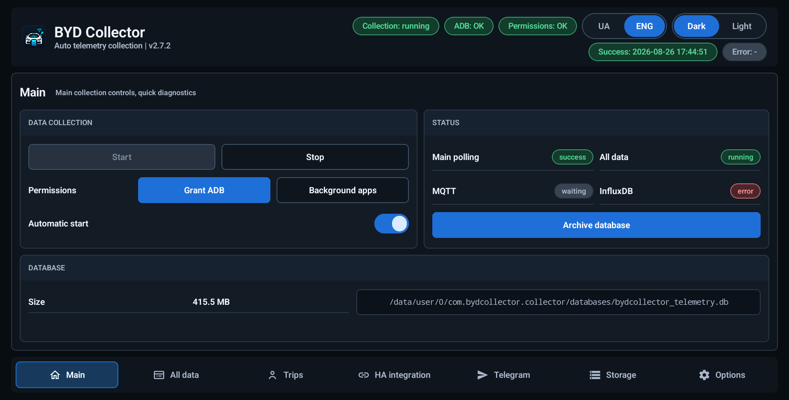
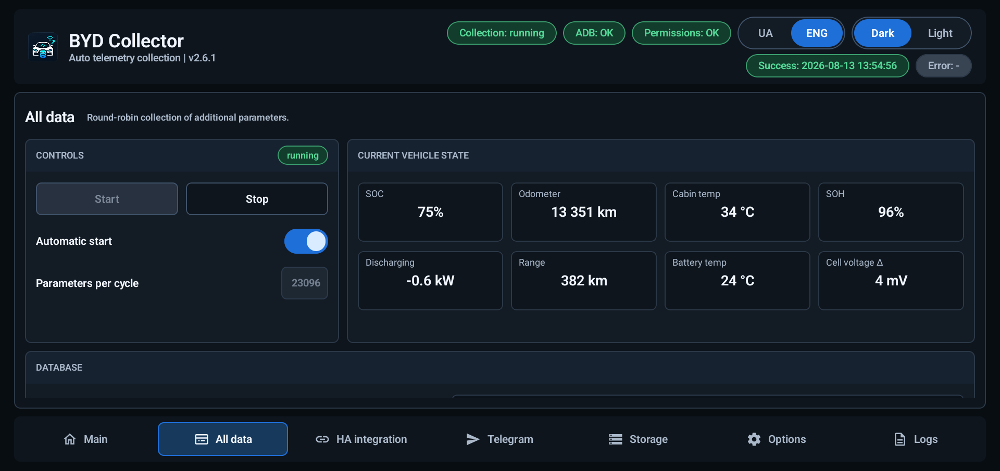
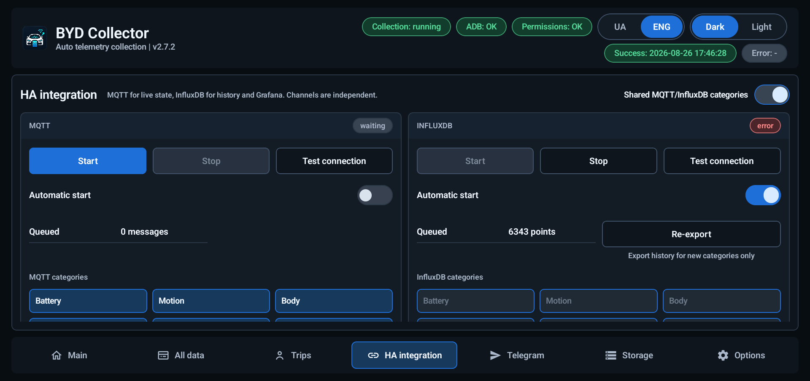
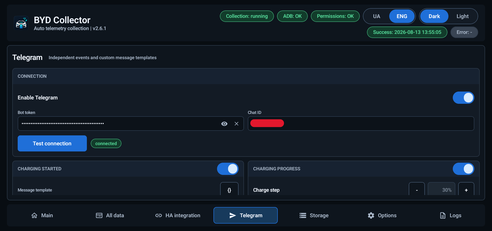
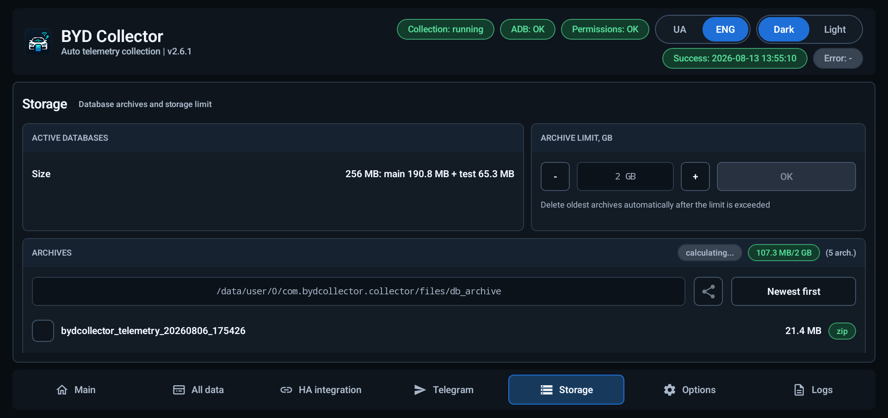
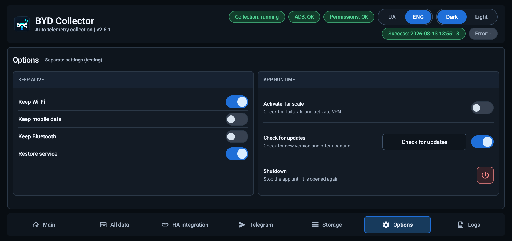

# BYD Collector

**English** | [Українська](README.uk.md)

BYD Collector is a read-only telemetry collector for Chinese-market BYD vehicles using DiLink 5.0. It reads vehicle values through the local Android ADB bridge and an APK-owned `app_process` helper, keeps the raw readings in SQLite, derives a normalized vehicle state, and optionally exports that state to MQTT/Home Assistant, InfluxDB, and Telegram.

- **Vehicle focus:** Chinese-market BYD Sea Lion 07 EV
- **Current source version:** `v2.7.0` development candidate; latest published release: `v2.6.3`
- **Package:** `com.bydcollector.collector`
- **Download:** [latest GitHub release](https://github.com/sunlixWhyNotAvailable/byd-collector/releases/latest)
- **Help:** read [Troubleshooting](#troubleshooting), then [Report a problem](#report-a-problem)

> **AI disclosure:** Generative AI tools are used in this project for code and diagnostic-log analysis, implementation, testing, and documentation.

The collector is an engineering and research tool, not an OEM diagnostic or safety system. It never sends vehicle-control commands.

## How collection works

The production path is deliberately local and read-only:

1. The Android app checks the local ADB bridge and starts the packaged helper with the app's class path.
2. The helper uses only the approved getter transactions (`5` and `7`) and a fixed read whitelist.
3. Each poll preserves the raw value, field name, Chinese name/description when available, quality, elapsed time, stale/failure state, and partial-success metadata in SQLite.
4. Normalized fields are derived from the raw record for the UI and integrations. Unknown fields and values remain queryable; enum meanings are field-specific rather than globally assumed.

The legacy Di+ HTTP collector is research context only. It is not the production transport and is not required for this APK.

The UI keeps the latest dashboard snapshot in a process-wide cache. Opening or resuming the app and switching tabs therefore renders the last known state immediately, while scoped background refreshes replace only data that can actually change. KPI values and row-count deltas are fed directly from successful collection/storage work; SQLite full counts are used only to establish or rebuild a baseline after startup or database maintenance.

## Features

| Area | What it provides |
| --- | --- |
| Read-only transport | Local ADB plus a versioned `app_process` helper with an APK-owned read whitelist |
| Main tab | Start/stop the curated 82-field read-only poll, automatic start, current status, database health, and quick diagnostics |
| All data tab | Round-robin research polling of the full 23,096-signature catalog, with raw values and change/transition evidence |
| Normalized state | SOC, SOH, range, odometer, battery energy, charging, power, temperatures, doors, tires, climate, speed, radar, and related vehicle fields |
| MQTT / Home Assistant | Home Assistant MQTT Discovery and live current-state topics for selected categories |
| InfluxDB | Independent `InfluxDB v1` historical export with durable cursors and retry state |
| Telegram | Optional outbound event messages with editable templates and a durable FIFO outbox |
| Trips | Separate local trip history, GPS routes, configurable speed/consumption colours, and an online OpenStreetMap view |
| SQLite and archives | Compact-v2 raw/normalized stores, crash-safe database cutover, ZIP archives, sharing, and a shared archive limit |
| Runtime | Background recovery, optional Tailscale activation, network/Bluetooth keep-alive controls, and explicit shutdown |
| Diagnostics | User-started full-system logcat under `Options -> Keep alive`, local status/error history, and selected archive sharing |

The app UI is available in English and Ukrainian and supports dark and light themes.

## Main tab

`Main` controls the production poll. Start it after ADB is authorized, or enable its automatic-start switch for supported boot and runtime events.

- The curated main catalog contains 82 direct fields, including the read-only power-boundary candidate.
- One detached helper owns Main reads exclusively: 500 ms while the app consumes its Binder spool and 5 seconds while detached. The app imports each immutable worker sample idempotently before acknowledging it; intentional Main Stop/Shutdown stops the worker, while ordinary app-process loss leaves it collecting until recovery or kernel reboot.
- Integer and float values use grouped native reads where possible, with ordered results and an in-helper scalar fallback.
- The status card shows polling, MQTT, and InfluxDB states, last success, last error, and session errors.
- The normalized vehicle-state cards show current SOC, SOH, odometer, cabin and battery temperatures, charging/discharging, range, cell-voltage delta, and category summaries.
- Main raw polls remain authoritative. Normalized history is lossless and currently has no automatic retention period or downsampling.

Use `Stop` before maintenance or when the car should no longer be polled. A failed or incomplete poll is recorded as such; the UI does not silently turn an unknown value into a valid one.

## All data tab

`All data` is the research/debug lane. It can be started independently after the main runtime is available.

- The full catalog currently contains 23,096 read-only signatures.
- A round-robin cycle sends the catalog as one helper request on the existing 500 ms cadence; it is not split into arbitrary 10,000-entry runtime steps.
- Raw values, descriptions, quality, and transition/change evidence are stored in the separate round-robin database.
- This lane is useful for discovering changing fields. A changing value is not, by itself, a confirmed field meaning; promote fields only with field-specific evidence.

Round-robin storage is cut over and checked before a debug session starts. Stopping the lane does not change the main poll.

## Trips and routes

The `Trips` tab stores power-on to confirmed-power-off sessions in a separate app-private `bydcollector_trips.db`. It keeps only trip summaries and GPS route points/gaps; it does not duplicate the full Main telemetry catalogue. Zero-motion sessions remain stored but are hidden from the ordinary list.

Route recording uses Android's GPS provider after the user grants location access. During serialized first-run setup, the app requests fine/coarse location once before the ADB authorization step; after a denial, access must be granted later in Android settings. Mock, invalid, stale, clock-skewed, or physically impossible fixes are retained only as diagnostics and become route gaps. After a rejection, callback outage, or location-source restart, three mutually consistent fresh fixes are required before location is trusted again. The map uses online OpenStreetMap tiles, fits the trusted route, and can colour segments by speed or instantaneous consumption. A compact blue dot marks Start; a neutral circle with a white flag marks Finish, with a matching localized legend in the lower control row. Defaults are speed colouring with `90/30 km/h` thresholds and consumption thresholds of `15/20 kWh/100 km`.

There is currently no automatic trip-route retention or trip-database archive action. The maintainer will measure the real database/WAL footprint after several days before selecting a retention policy.

## MQTT, Home Assistant, and InfluxDB

The `HA integration` tab configures the two off-car export channels. They are independent: a problem with one channel does not make a successful main poll fail.

### MQTT and Home Assistant

- Publishes Home Assistant MQTT Discovery configuration and live normalized vehicle state.
- Select battery, motion, body, climate, safety, and location from the ordinary category grid.
- The location category remains off by default. When enabled, it publishes the latest trusted normalized GPS state; local trip/location recording remains independent of export selection.
- Configure host, port, username/password, client ID, topic prefix, and discovery prefix.
- MQTT is for current state. A disconnected Home Assistant broker can mean that a live state is missed; SQLite remains the local source of truth.
- A failed publish becomes eligible again after 30 seconds. The `v2.7.0` source schedules one persisted single-flight retry at that deadline; the published `v2.6.3` build still waits for the next state update or status heartbeat.

### InfluxDB

- Exports normalized history to `InfluxDB v1` for long-term charts and Grafana.
- Configure host, port, database, measurement, credentials, and categories independently of MQTT.
- The location category remains off by default. When enabled, timestamped trusted GPS history uses the same durable per-field cursor contract as the other categories.
- A persisted cursor is kept for each selected field. Export is independent of main polling while the service is alive: successful globally ordered batches contain up to 300 rows and continue once per second while backlog remains; a real write failure uses a 30-second retry delay.
- `Re-export` is available when new categories are enabled; existing cursor state prevents duplicate history in normal operation.

Transport security and TLS deployment are separate integration decisions. Protect the endpoint and credentials on the network where the collector is used.

## Telegram notifications

Telegram is optional and disabled by default. It sends plain text through the Telegram Bot API only; the collector does not accept commands, register webhooks, poll updates, or send media.

Configure the bot token, chat ID, event switches, delay values, and message templates in the `Telegram` tab. Secrets are stored with the Android Keystore, shown masked by default, and can be cleared explicitly.

Supported event templates include:

- charging started, charging progress, charged to 100%, and charging stopped;
- charge-gun connected and disconnected;
- low 12 V voltage;
- telemetry unavailable; and
- trip summary.

Charging-progress templates can report energy/SOC and localized duration for both the current step and the whole charging session. Untouched built-in templates follow the persisted app language; edited templates retain their exact text. On this candidate upgrade, an already persisted trip-summary template is replaced once with the expanded built-in and classified as a default. Trip summaries separate the current `P -> non-P -> P` trip from totals observed during the current vehicle boot, and both energy lines include start-to-end SOC. A summary is eligible for an SOC change of at least 1%; otherwise the trip must exceed 0.1 km or 0.1 kWh. A short `P` below the configured delay remains part of the same trip; once that deadline expires, the old trip is finalized before a new drive can replace it. A parked trip restored after process loss is finalized before fresh telemetry. The first valid power-off sample bypasses the parked delay and durably queues and immediately attempts the summary while the network may still be available.

Trip-summary location is off by default. The separate `Send location` button opens a blocking modal with independent Google, Waze, Apple, and OSM selections; choosing zero links is allowed. When enabled, the same summary receives only the selected navigation links in that order, without separate coordinate, capture-time, or age rows. Missing trusted location or an empty selection never blocks the summary; no second Telegram message or media upload is created.

The outbox keeps FIFO order among unblocked ordinary events. Retryable failures retain their backoff; permanently blocked rows remain for diagnosis but do not hold later messages. A summary finalized by the first valid power-off sample is attempted immediately after its durable commit, and a pending summary receives one priority attempt when the enabled Telegram runtime starts. Other events keep ordinary unblocked FIFO order. Successful delivery schedules the next eligible row immediately without a fixed pacing delay. Telemetry-unavailable timing is rebased when the Telegram runtime is enabled, so a kernel/process restart or later enable does not immediately replay an outage from stale timestamps. Trip-summary delay is configurable from 5 to 300 seconds (10 seconds by default).

## Storage and archives

SQLite is the authoritative long-term store. JSON is used for export/transport, not as the primary database.

- Fresh installations use compact-v2 main and round-robin schemas.
- Raw readings are retained before normalization; normalized current state and history use compact identifiers and quality codes while preserving queryability.
- Existing databases are archived before the format cutover; they are not migrated in place or deleted as part of that transition.
- Main cutover is automatic only when Telegram, MQTT, and all InfluxDB cursors have no queued work and Telegram has no unfinished event state. Otherwise the app records a defer state and waits for an explicitly confirmed manual archive.
- Round-robin cutover runs before debug polling starts. Both lanes verify the archived source format and SQLite `quick_check`, use crash journals and rollback boundaries, and then enter the shared ZIP archive pipeline.
- The `Storage` tab shows active databases, archive size/count, sort order, and the configured shared archive limit. It can share selected ZIP archives or delete selected archives after confirmation.
- The limit applies to completed archives; the oldest archives are removed after the configured limit is exceeded. The active main normalized history remains unbounded until a future retention decision.

Archive maintenance can temporarily stop collection and integrations. Read the confirmation dialog: it shows queued Telegram/MQTT/InfluxDB work and warns when an operation cannot be stopped safely after it begins.

## Options and runtime

The `Options` tab contains operational controls rather than vehicle-control commands:

- switch English/Ukrainian and dark/light themes;
- grant or re-check ADB access and open the DiLink background-app settings;
- enable automatic start for main collection, All data, MQTT, and InfluxDB where shown;
- keep Wi-Fi, mobile data, or Bluetooth available while the runtime is active;
- restore the collector service after supported process/boot events;
- start or stop the single full-system logcat recorder at the bottom of `Keep alive`;
- grant and verify the notification-listener lifecycle anchor through the app's local-ADB repair flow; the service reads no notification payloads;
- keep Wi-Fi and mobile data enabled from the separate detached keep-alive helper every 30 seconds when their switches are enabled;
- optionally detect and activate Tailscale when a configured endpoint is unreachable, with a delayed launch and foreground-task restoration; and
- check for a verified update, or use `Shutdown` to stop runtime until the app is opened again.

The app's keep-alive path is recovery-oriented and idempotent. It does not write vehicle values or invoke vehicle-control APIs.

## Diagnostics and privacy

There is no separate `Logs` tab or duplicate Journal mode. Start and stop the one logcat recorder at the bottom of `Options -> Keep alive` when investigating a reproducible issue. Start waits for the completed ADB authorization check, and recorder start/stop plus snapshot/ZIP work runs away from the UI thread. Capture uses the exact full-system command `logcat -b all -v threadtime`; it does not silently fall back to a PID-filtered app-only file.

Diagnostics stay local unless you explicitly share an archive through the Android chooser. A selected archive can contain raw telemetry, Chinese field names/descriptions, timestamps, quality/failure metadata, vehicle-state history, network endpoint settings, and logcat output if recording was enabled. Review the archive contents and remove unrelated days before sharing. Do not publish bot tokens, passwords, private addresses, or precise trip/location data.

The collector does not automatically upload telemetry, screenshots, crash reports, or logcat to the project. MQTT, InfluxDB, and Telegram are opt-in destinations configured by the user. Read the complete data-handling policy in [PRIVACY.md](PRIVACY.md).

## Installation and ADB

### Requirements

- Android 8.0 (API 26) or newer;
- a compatible Chinese-market BYD vehicle with DiLink 5.0;
- permission to install APK files on the vehicle tablet; and
- local ADB access to the vehicle tablet.

### First setup

1. Download the current APK from [GitHub Releases](https://github.com/sunlixWhyNotAvailable/byd-collector/releases/latest) and verify the release checksum when one is published.
2. Install and open **BYD Collector** on the vehicle tablet.
3. Follow the first-run background-app prompt and set `Disable background Apps -> BYD Collector` to `OFF`.
4. Accept the one-time Android fine/coarse location request if route recording is wanted. After a denial, grant it later in Android settings; the app does not repeatedly prompt.
5. When Android shows the ADB RSA prompt, confirm it. In the app, use `Grant ADB` to re-check the bridge.
6. Start `Main` and confirm that the status changes from waiting to successful polling.
7. Enable the default-off `location` category only for MQTT/Influx channels that need precise-location export.
8. Enable only the integrations and Telegram events you need, then test each connection from its tab.
9. Start `All data` only for research sessions; it writes a separate, much larger database.

ADB is required for direct vehicle reads and for the helper startup. Without an authorized bridge the app can still open and show stored data, settings, and archives, but it cannot collect fresh vehicle telemetry. Re-authorize after a tablet reset, Android security prompt, or changed host key.

## Troubleshooting

### Main stays in `waiting` or reports `ADB`/permission errors

- Confirm the tablet is awake and the local ADB bridge is authorized.
- Press `Grant ADB` and accept the RSA prompt again if Android asks.
- Set `Disable background Apps -> BYD Collector` to `OFF`.
- Stop another copy of the collector or an app that may own the local ADB session, then start Main again.
- Start logcat under `Options -> Keep alive`, reproduce the issue, then stop it to finish the diagnostic bundle.

### Main is successful but a value is blank, stale, or unknown

This can be a vehicle-side unavailable field, an incomplete helper response, or a field without a confirmed mapping. The raw value and quality metadata remain queryable. Do not infer a global enum meaning from one field or one driving session.

### All data is slow or storage grows quickly

All data intentionally polls the research catalog and stores raw evidence. Stop it when the session is complete, archive the round-robin database from `Storage`, and share only the affected archive when reporting a discovery.

### Home Assistant or MQTT is offline

Check the broker host/port, credentials, topic/discovery prefixes, and selected categories. MQTT publishes current state only; historical gaps are expected while the broker is unreachable. Main collection and SQLite continue independently.

### InfluxDB is behind or shows retries

Check endpoint credentials, database/measurement, and category selection. The exporter retains cursors, drains successful backlog in 300-row batches paced one second apart, and waits 30 seconds only after a real write failure. A successful poll does not imply that every queued history row has already reached InfluxDB.

### Telegram messages are delayed or missing

Verify the bot token and chat ID with `Test connection`, enable the specific event, and inspect pending outbox rows. Retryable messages wait for their recorded backoff; permanently blocked rows are skipped until a successful connection test or credential change unblocks them.

### Archive is deferred or maintenance cannot start

Finish or explicitly review queued Telegram/MQTT/InfluxDB work. Main cutover waits for empty integration queues and no unfinished Telegram event state. Use the confirmation dialog and do not interrupt a running archive operation.

## Report a problem

Open a [GitHub issue](https://github.com/sunlixWhyNotAvailable/byd-collector/issues) and include:

- collector version and APK build;
- vehicle model/year, market, DiLink version, and tablet firmware;
- whether ADB was authorized and which tab/status failed;
- the approximate local time, expected behavior, and observed behavior; and
- the smallest relevant selected database or diagnostic archive, after removing secrets and unrelated trips.

For a collection problem, reproduce it once with full-system logcat recording. For an integration problem, include the channel status and endpoint type without posting credentials. For a catalog discovery, include the All data archive and explain how the value changed; changing alone is not proof of semantics.

Archives can expose vehicle identifiers, raw Chinese descriptions, timestamps, trips, and location-related values. Review the warning and share the minimum necessary data.

## Known limitations

- The project is tested primarily on the Chinese `BYD Sea Lion 07 EV 2025` with `DiLink 5.0`; other models, regions, firmware, and tablet builds may expose different fields or behavior.
- Production reads are read-only. Vehicle-control/write paths are intentionally unsupported.
- ADB authorization and BYD background-app policy can be lost after resets or firmware changes.
- The full All data catalog is research evidence, not a guaranteed normalized schema. Unknown fields and field-specific enums require new evidence.
- Main normalized history is currently lossless and unbounded. No retention period, downsampling, `VACUUM`, or size-triggered rotation is enabled.
- Trip routes are also unbounded until their real multi-day database footprint is measured; online maps require OpenStreetMap tile connectivity.
- The first physical-vehicle `v2.7.0` gate found a shell-UID SQLite spool failure and a missing automatic location prompt. The current candidate replaces shell SQLite with the validated file spool and adds the serialized one-time permission request; these corrections are host-verified but still require installation and revalidation on the vehicle.
- The `BODYWORK_POWER_LEVEL` `0/2` boundary and post-kernel-reboot recovery path still require the planned physical-vehicle validation before this build is relied on unattended.
- MQTT is a live-state channel and can miss updates while the broker is offline. InfluxDB v1 export is cursor/retry based and intentionally paced.
- Telegram delivery depends on external Bot API reachability; retryable failures remain subject to their persisted backoff.
- Optional Tailscale activation depends on the vehicle's network and process policy; it is not required for local collection.
- No physical-vehicle installation or live-car timing claim is implied by a source build or unit-test result; validate changes on the intended tablet before relying on them.

## Tested device

| Vehicle | Market | DiLink | Status |
| --- | --- | --- | --- |
| BYD Sea Lion 07 EV 2025 | China | 5.0 | Tested by the maintainer |

The collector may work on other Chinese-market BYD vehicles, but their parameter catalogs and enum values must be verified independently.

## License and disclaimer

BYD Collector is licensed under the [GNU Affero General Public License v3.0](LICENSE).

This is an independent project. It is not affiliated with, endorsed by, or sponsored by BYD, DiLink, MQTT, Home Assistant, InfluxDB, Telegram, or any vehicle manufacturer. Product names and trademarks belong to their respective owners.

Use the software at your own risk. Telemetry can be incomplete, delayed, stale, or wrong; it must not be used as a safety-critical or legally authoritative source. Keep attention on the road and install, configure, or diagnose the system only while parked.
