# BYD Collector

**English** | [Українська](README.uk.md)


BYD Collector shows vehicle status, records telemetry and trips, and can send data to Home Assistant, InfluxDB, and Telegram. Data is stored locally; external integrations are optional.

**Vehicle access is read-only. The app does not send vehicle-control commands.**

- **Compatibility:** primarily tested on the Chinese-market BYD Sea Lion 07 EV 2025 with DiLink 5.0. Other models and firmware may provide different data.
- **Download:** [latest GitHub release](https://github.com/sunlixWhyNotAvailable/byd-collector/releases/latest).
- **Help:** [Troubleshooting](#troubleshooting) · [Report a problem](#report-a-problem) · [Privacy](PRIVACY.md).
- **Donate:** [Support the project by card number](#support-the-project).

## Installation and first start

You need Android 8.0 or newer, a compatible DiLink system, permission to install APK files, and local ADB access. ADB is the Android connection the app uses to read vehicle data.

1. Download the APK from the release page and compare its SHA-256 checksum with the published value when available.
2. Install and open **BYD Collector** while parked.
3. Follow the background-work prompt: set `Disable background Apps -> BYD Collector` to `OFF` in DiLink settings.
4. Accept Android's ADB authorization prompt when it appears. Use `Grant ADB` in the app to check access.
5. Allow Android location access if you want GPS routes. If you declined it, you can grant it later in Android settings.
6. Start collection on `Main` and check its status and readings. Enable automatic start if wanted.
7. Configure only the integrations you need and test each connection before using it.

Without ADB authorization, fresh telemetry cannot be collected, but stored data and settings remain accessible. Authorization and background permissions may need restoring after a tablet reset or firmware update.

## Everyday use

The interface supports English and Ukrainian, with dark and light themes.

Screenshots show the Preview interface with demonstration data; values and statuses are illustrative.

<!--
Approved modal/overlay screenshots captured on 2026-10-02: 12 views per locale,
dark theme, com.bydcollector.uipreview, demonstration data only. Long dialogs are
scroll-stitched without repeating fixed controls. Existing tab screenshots are unchanged.
Installed Preview APK SHA-256: 19CF07802C2122D0BFFBD855D1D6C3FC498E463177172383D2FE109429771A01.
Update dialogs, background-work prompts, log clearing, donation and HA menus are excluded.
-->

### Main collection and vehicle status

Use `Main` for regular collection. Its Start/Stop controls and automatic-start setting are independent of the secondary collector.

- Status cards show battery charge and health, remaining energy, range, odometer, temperatures, charging, and other available readings.
- These cards can update while the vehicle is on even when both collectors are stopped.
- Collection status shows recent success and errors. Missing or unknown values are not treated as valid zeroes.
- Telemetry is saved locally. Monitor storage: active history is not automatically deleted.
- Range in the cards and Telegram is an estimate based on consumption when available and may differ from the vehicle's range exported to MQTT/InfluxDB.

<p align="center">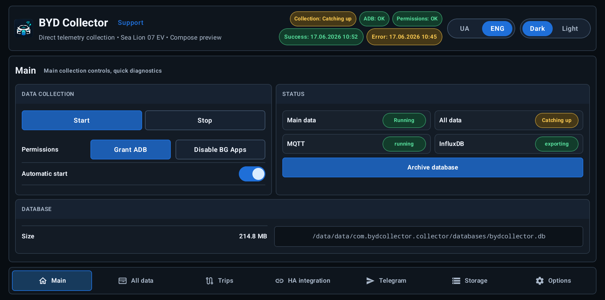</p>

### Secondary collection — All data

`All data` records a broader set of additional vehicle parameters in a separate database. It is optional and mainly useful for diagnostics or investigating readings not included in Main.

Start and stop it independently. It can use substantial storage, so stop it when no longer needed and archive its database when appropriate. Not every parameter is available or has a confirmed meaning on every vehicle.

<p align="center">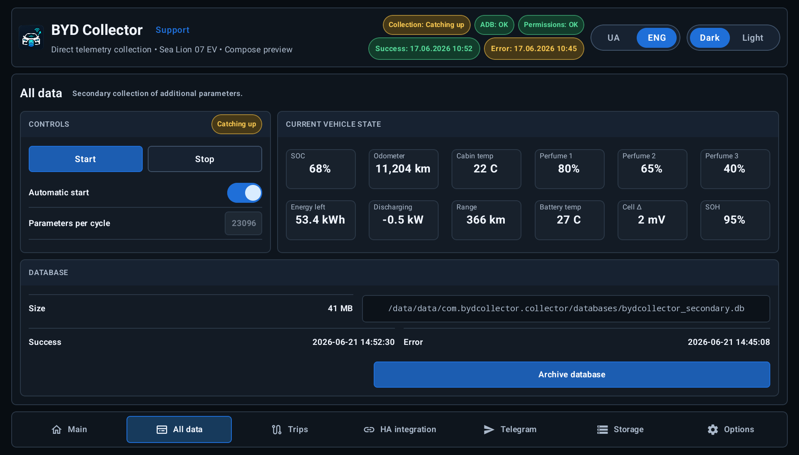</p>

### Trips and routes

`Trips` shows sessions from vehicle power-on to power-off, with distance, time, battery information, and GPS routes. Sessions without movement are hidden from the ordinary list.

- Routes use OpenStreetMap and can be coloured by speed or consumption; colour thresholds are configurable. Gray consumption sections mean missing data, not zero.
- Energy used, recovered energy, and battery net are shown separately. Average consumption uses the net balance and can be negative.
- GPS interference, poor reception, or rejected position jumps can leave gaps. Maps need internet access.
- Route compression reduces storage without removing trips or route points. It is not deletion or database archiving.

<p align="center">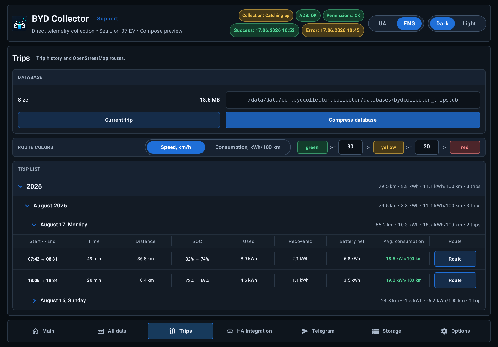</p>

#### Route details and current trip

Open a trip to view its metrics and route, or use `Current trip` for the active session. The flag on a current trip marks the latest trusted coordinate. `Last known position` means it may no longer be the vehicle's current location.

<details>
<summary>Route, current trip, and compression screenshots</summary>

The maps below are synthetic Preview illustrations, not real OpenStreetMap routes or vehicle recordings.

Completed trip, coloured by consumption:

<p align="center"><a href="docs/screenshots/en/trip-route.png">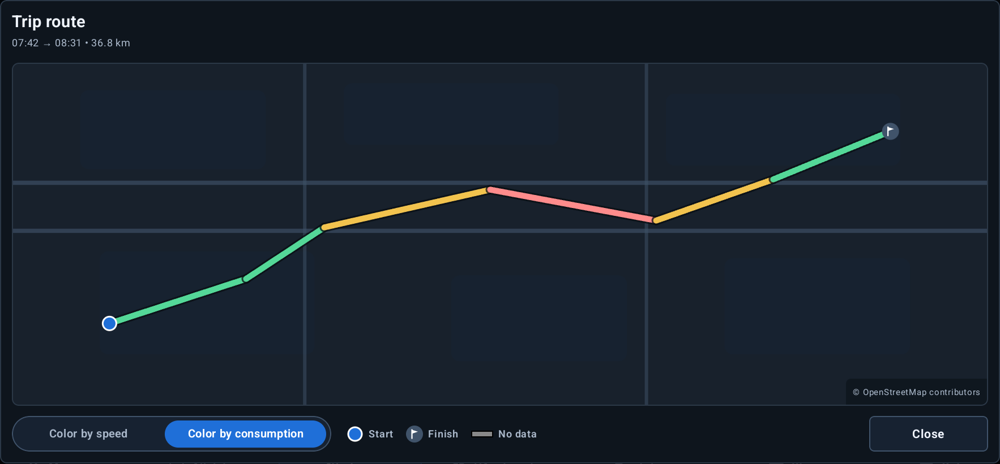</a></p>

Current trip, coloured by speed, with metrics and the current-position flag:

<p align="center"><a href="docs/screenshots/en/current-trip.png">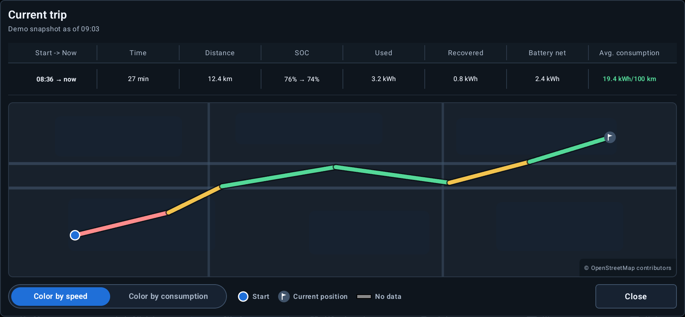</a></p>

Route compression confirmation:

<p align="center"><a href="docs/screenshots/en/trips-compress.png">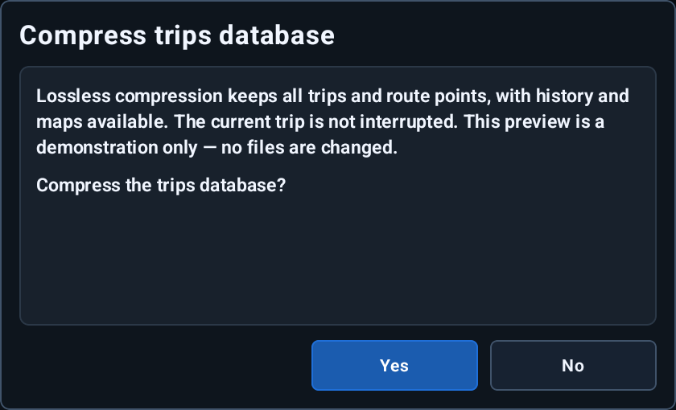</a></p>

</details>

## Optional integrations

### MQTT, Home Assistant, and InfluxDB

Configure these independent channels on `HA integration`. Connection failures do not stop local collection.

| Channel | Purpose | Settings |
| --- | --- | --- |
| MQTT / Home Assistant | Current vehicle state and automatic Home Assistant entity discovery | Broker host/port, credentials if required, client ID, topic and discovery prefixes, categories |
| InfluxDB v1 | Historical data for charts and Grafana | Server host/port, database, measurement, credentials if required, categories |

1. Enter the server settings and select the categories to send.
2. If needed, configure an alternative address for the **same server**, such as a VPN address.
3. Use `Test connection` for the selected profile, then start the channel and enable its automatic start if wanted.
4. Stop the channel before editing connection settings. The selected profile and the connection currently in use are shown separately.

Location export is **off by default** for each channel and is separate from local route recording. Enable it only if you want precise coordinates sent to that destination.

MQTT sends current state, so updates can be missed while offline. InfluxDB saves export progress and resumes history after reconnection; a successful connection test does not mean all pending history has been sent.

**Use a trusted network or VPN. Current MQTT and InfluxDB connections are not encrypted with TLS.** Protect the server and credentials; see [Privacy](PRIVACY.md).

<p align="center">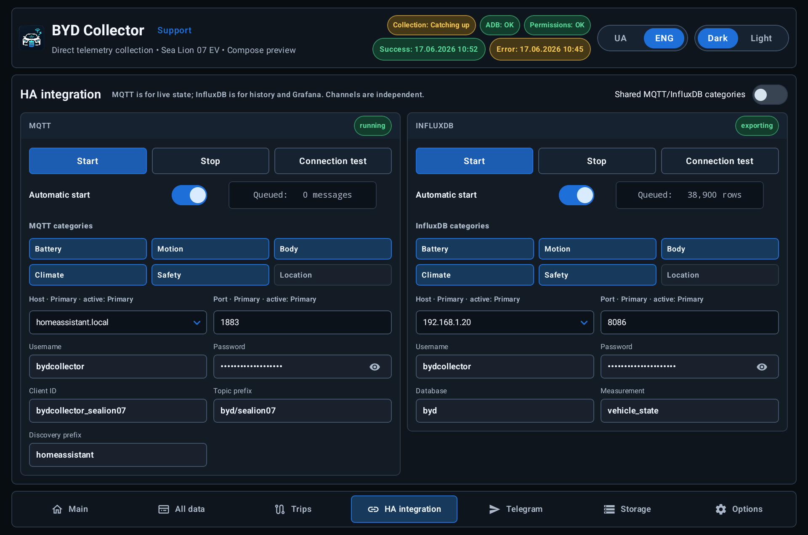</p>

### Telegram notifications

Telegram is optional and off by default. It sends text messages through your bot; it does not accept remote commands or send route images.

1. Enter your bot token and chat ID on `Telegram`.
2. Use `Test connection`.
3. Enable the events you want: charging start/progress/full/stop, cable connection changes, low 12 V battery voltage, missing telemetry, or trip summaries.
4. Adjust delays, thresholds, and message templates if needed. Custom templates are preserved.

Trip summaries can be sent after the configured parking delay in `P`. When the vehicle switches off, the app attempts delivery immediately; network availability still determines whether it arrives then. A charging report covers only the part observed while collection was running.

`Send location` is off by default. Enable it and select Google, Waze, Apple, and/or OSM links to receive a location at vehicle power-off. If a trip summary was already sent, the location can arrive separately.

**When GPS is unavailable, the link uses the last trusted point, which may not be the final parking spot.** Without a trusted point, no location link is sent.

Pending messages survive app restarts and telemetry database archiving, and failed deliveries retry automatically. Storage is limited; messages are not retained indefinitely. Clearing diagnostic logs does not cancel pending messages.

<p align="center">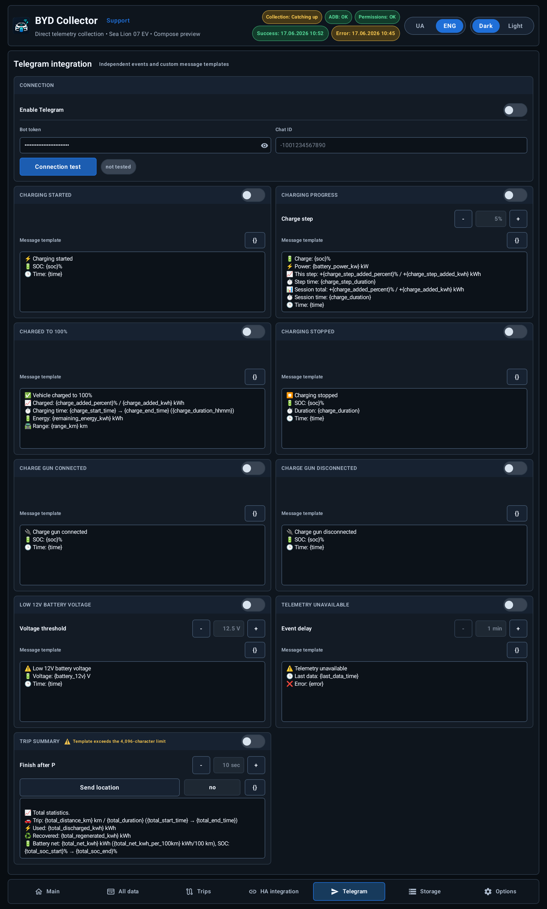</p>

#### Example: trip summary template

Use the `{}` button beside the trip summary template to choose a variable to insert into the message. Open `Send location` in the same section to choose whether to include a location and which navigator links to use.

<details>
<summary>Trip summary: variables and location settings</summary>

The complete variable picker for the trip summary template:

<p align="center"><a href="docs/screenshots/en/telegram-variables.png">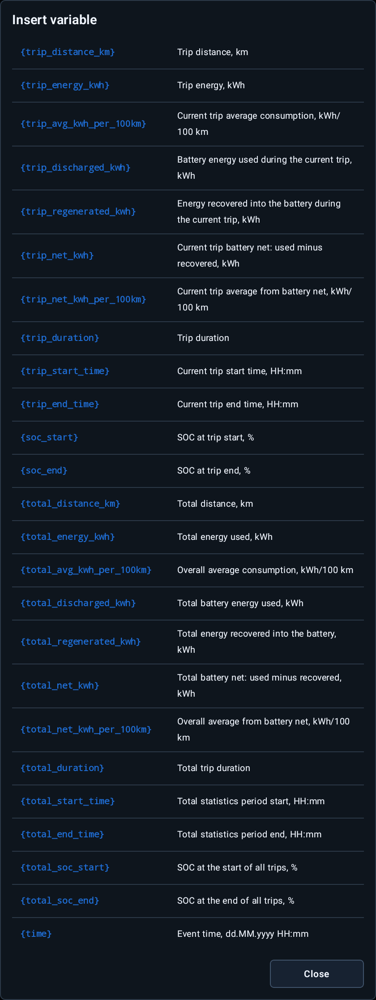</a></p>

Location and navigator settings. Enable the navigators whose links you want to receive:

<p align="center"><a href="docs/screenshots/en/telegram-location.png">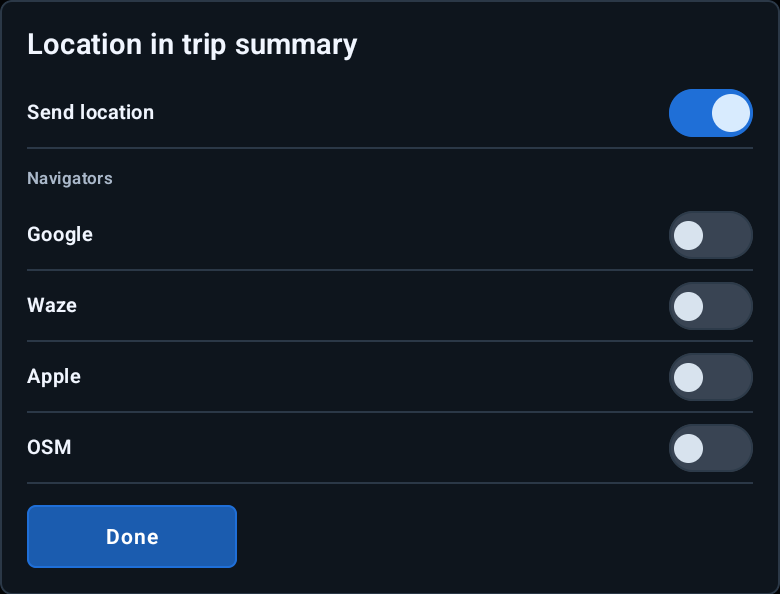</a></p>

</details>

## Storage and archives

Telemetry and trips are stored locally. `Storage` shows database sizes, existing archives, and the archive-size limit.

- **Archive Main:** use `Archive database` on Main.
- **Archive secondary collection:** use `Archive secondary database` on All data.
- **Share or delete an existing archive:** select it in Storage. Deletion requires confirmation.
- **Reduce route storage:** use compression on Trips; it preserves the route points.

The archive limit applies to completed Main/All data archives, **not active databases or trip history**. Automatic cleanup removes older eligible archives while protecting the newest archive of each type. Main and trip history can continue growing.

<p align="center">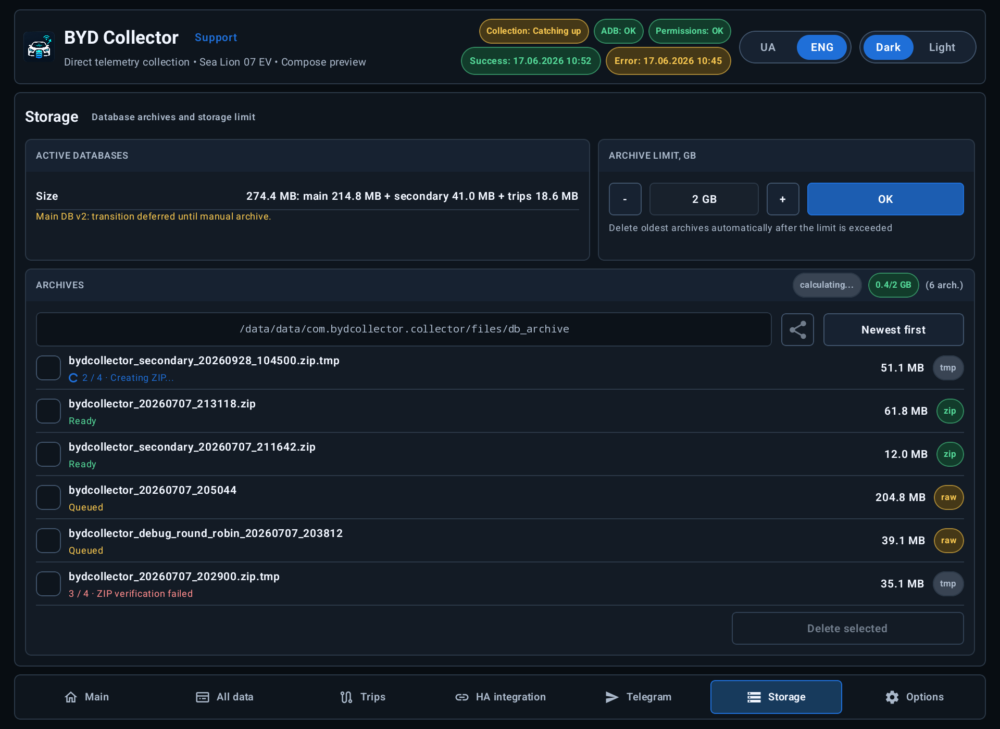</p>

### Archive confirmation and progress

Archiving preserves the selected database and starts a fresh one. It temporarily pauses that collector and its related exports; the other collector continues. Read the confirmation and pending-export warnings, keep enough free space, and do not interrupt the operation. Progress or errors appear with the archive.

<p align="center">
  <a href="docs/screenshots/en/archive.png">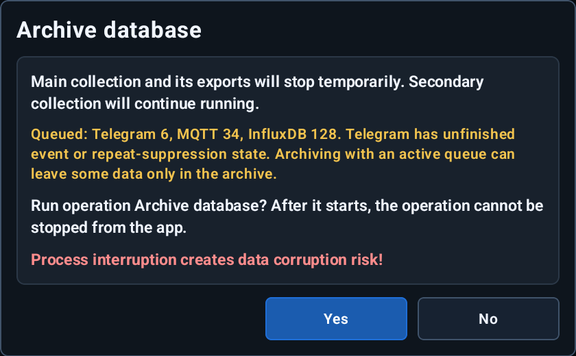</a>
  <a href="docs/screenshots/en/archive-done.png">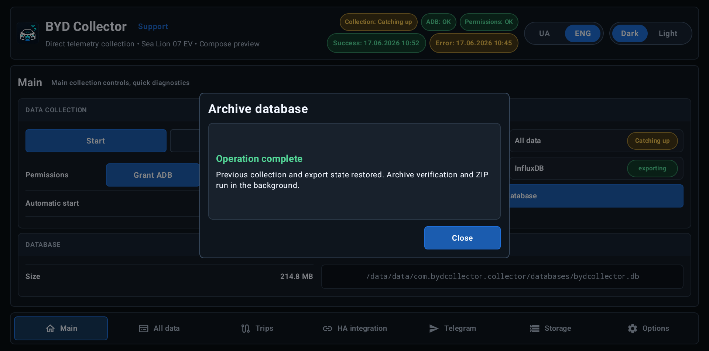</a>
</p>

<details>
<summary>Archive progress, secondary database, and deletion</summary>

An intermediate step of Main database archiving:

<p align="center"><a href="docs/screenshots/en/archive-progress.png">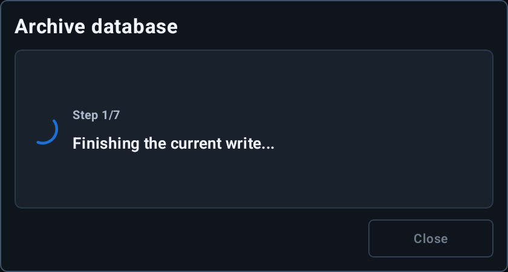</a></p>

Secondary database archive confirmation:

<p align="center"><a href="docs/screenshots/en/archive-secondary.png">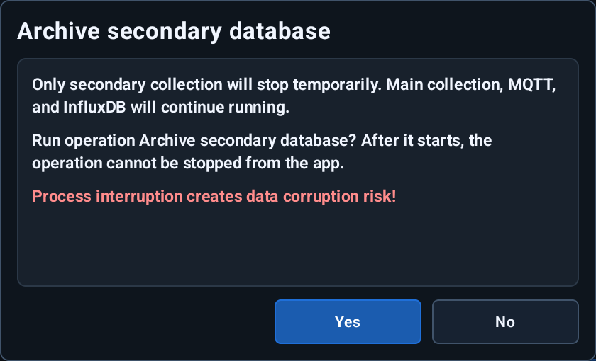</a></p>

Confirmation and progress when deleting selected archives:

<p align="center"><a href="docs/screenshots/en/archive-delete.png">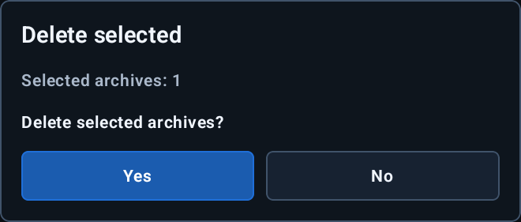</a></p>
<p align="center"><a href="docs/screenshots/en/archive-delete-progress.png">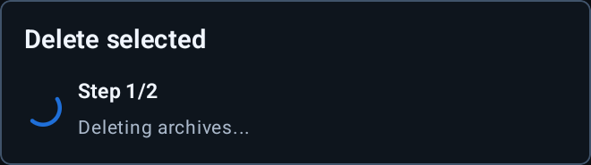</a></p>

</details>

## Background operation and updates

In `Options`, configure service recovery and, if needed, Wi-Fi/cellular recovery, Bluetooth recovery, or optional Tailscale activation. These restore Android services and connections, not vehicle controls. Notification access used for service recovery is not used to read notification contents.

Automatic-start switches on the collection and integration tabs control their respective functions. Use `Shutdown` to stop operation until you open the app again.

Collection can continue with the vehicle off on supported firmware, but uninterrupted recording is not guaranteed. Android may stop processes, and a tablet reboot interrupts collection. Recovery depends on the vehicle and firmware.

Update checks can run in the background and retry when the network returns. Use Options for a manual check. The optional update hint appears above other apps and requires Android's display-over-other-apps permission. Without it, ordinary in-app update offers and collection still work.

<p align="center">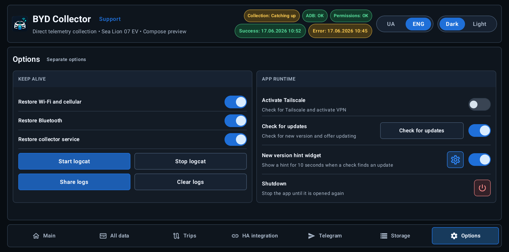</p>

### Update hint widget

The gear beside `New version hint widget` opens its appearance settings with a 1:1 preview: transparency, corner rounding, border width and colour, and widget size. The border-colour button opens a separate colour picker. The on-screen hint itself is a separate overlay; tapping it opens the update details.

<details>
<summary>Widget appearance, colour picker, and on-screen hint</summary>

All appearance controls and the 1:1 sample; the controls have been scroll-stitched into one image:

<p align="center"><a href="docs/screenshots/en/update-hint-settings.png">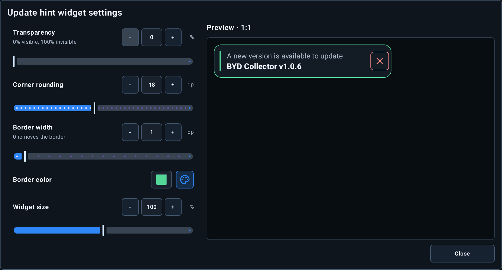</a></p>

Border-colour picker:

<p align="center"><a href="docs/screenshots/en/update-hint-color.png">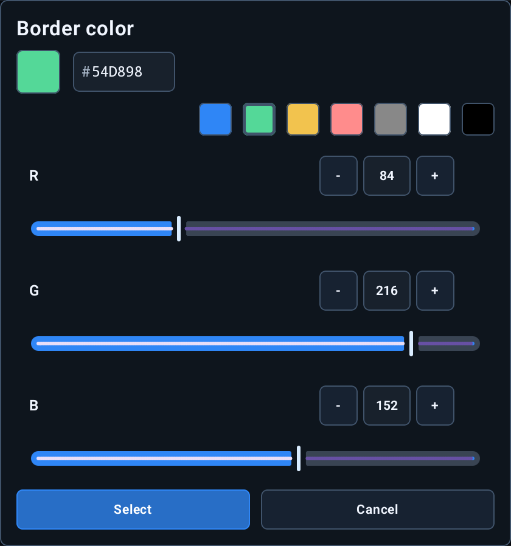</a></p>

The actual on-screen hint, cropped from an emulator capture (demonstration version number):

<p align="center"><a href="docs/screenshots/en/update-hint-overlay.png">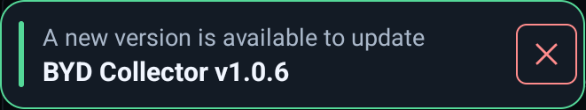</a></p>

</details>

## Troubleshooting

| Problem | What to check |
| --- | --- |
| Collection waits for ADB or reports a permission error | Keep the tablet awake, use `Grant ADB`, accept Android's authorization prompt, and check that `Disable background Apps -> BYD Collector` is `OFF`. |
| A reading is blank, stale, or unknown | The vehicle may not provide it or its meaning may be unconfirmed. Availability varies by model and firmware. |
| Storage grows quickly | Stop secondary collection when not needed, archive the relevant database, and compress routes. Deleting old archives does not shrink active databases. |
| MQTT/HA or InfluxDB cannot connect | Check the selected host/port, credentials, categories, and network/VPN, then test that profile. An alternative address does not fix wrong credentials. |
| InfluxDB is behind | Compare export progress over time. A successful test only proves connectivity, not completion of the export. |
| Telegram messages are missing | Test the bot token/chat ID, check the event switch and network. Location also requires an enabled navigator and a trusted GPS point. |
| Archiving is delayed or fails | Read the displayed stage/error and warnings, check free space, and allow pending processing/export to finish when possible. Do not interrupt an active archive. |

### Report a problem

1. For a reproducible issue, start system-log recording under `Options -> Keep alive`, reproduce it, then stop recording. This requires authorized ADB.
2. Press `Share logs` to prepare a diagnostic ZIP and choose where to share it.
3. Open [Report a bug](https://github.com/sunlixWhyNotAvailable/byd-collector/issues/new?template=bug_report.yml). Include the app version, vehicle/model year, DiLink/firmware version, approximate local time, and expected versus actual behaviour.

The diagnostic ZIP includes available app/system logs and troubleshooting summaries, **not telemetry databases**. If a database is requested, share the relevant archive separately through Storage. ZIP creation needs additional free space.

`Clear logs` removes diagnostic history and completed captures after confirmation. It does **not** delete telemetry databases, database archives, trips, or pending Telegram messages, and does not stop active system-log recording.

**Review files before sharing.** Recognized sensitive values are masked in diagnostic copies, but full-system logs are not guaranteed anonymous and can contain data from other apps. Database archives may contain location and vehicle identifiers. Share only what is needed; never publish tokens or passwords.

Telemetry and logs are not automatically sent to the developer. External integrations are destinations you choose. Read the full [privacy policy](PRIVACY.md).

For other feedback, [suggest an improvement](https://github.com/sunlixWhyNotAvailable/byd-collector/issues/new?template=suggestion.yml) or use the [issue chooser](https://github.com/sunlixWhyNotAvailable/byd-collector/issues/new/choose).

## Support the project

Donations voluntarily support the development and improvement of BYD Collector and apps for BYD cars.

**Jar card number — primary donation method:**

```text
4874 1000 3354 3078
```

Copy this number and use your bank's card-to-card transfer feature. You do not need the mono app for this method; availability, limits, and fees depend on your bank or transfer provider. Check the recipient details before confirming.

<details>
<summary>Alternative: monobank Jar link and QR code</summary>

[Open the donation Jar](https://send.monobank.ua/jar/bKFV15i9e), or scan the QR code:

<p><a href="https://send.monobank.ua/jar/bKFV15i9e"></a></p>

</details>

The same details are available under `Support` beside the app title. Donations are optional; the app never makes a payment automatically.

## License

BYD Collector is licensed under the [GNU Affero General Public License v3.0](LICENSE). It is an independent project, not affiliated with or endorsed by BYD or the services mentioned here. Trademarks belong to their respective owners.

Generative AI tools are used for development, testing, diagnostic analysis, and documentation.

Use the app at your own risk. Readings can be incomplete, delayed, or incorrect; this is not a safety system or an authoritative diagnostic tool. Install, configure, and troubleshoot only while parked.
