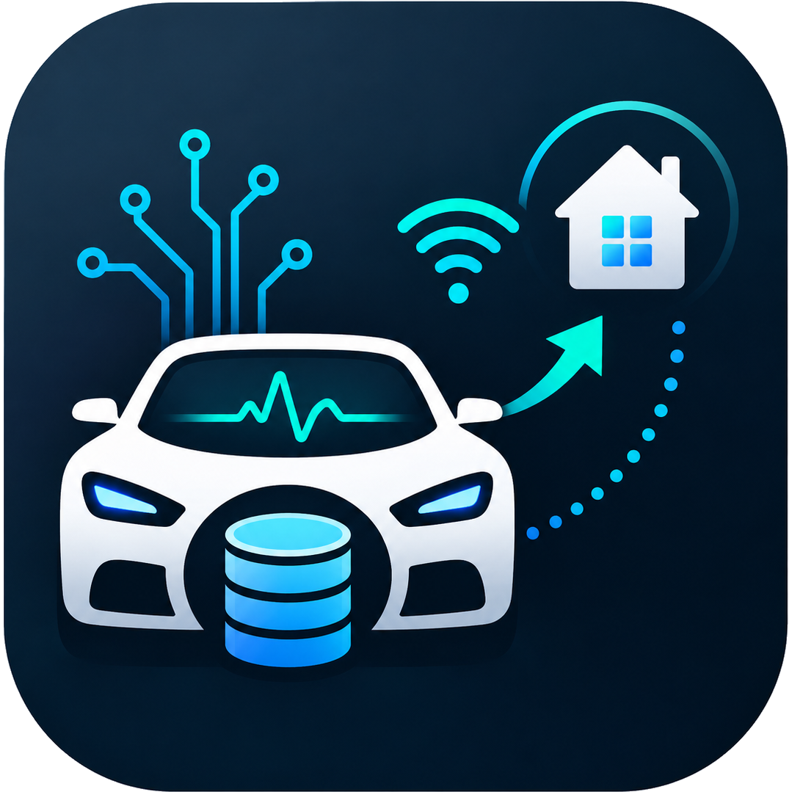
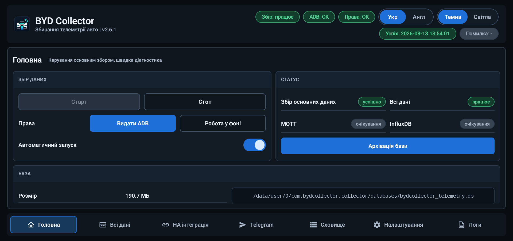
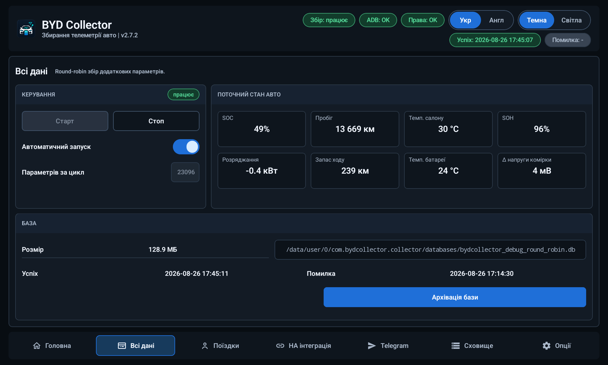
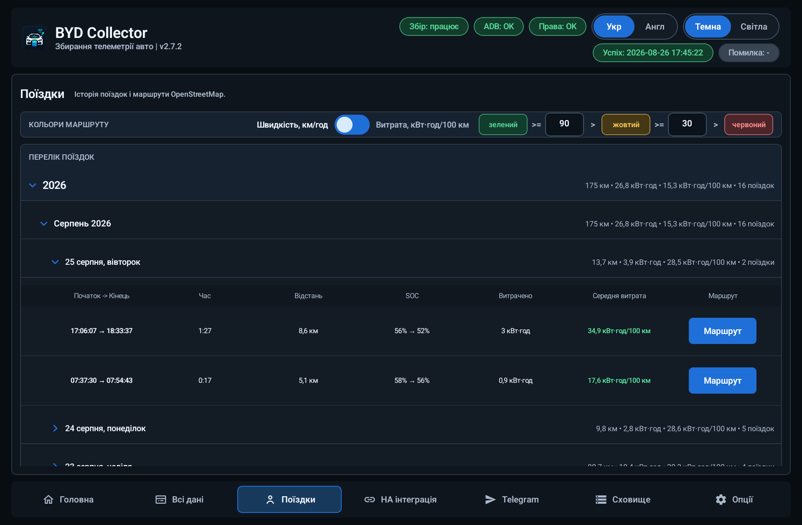
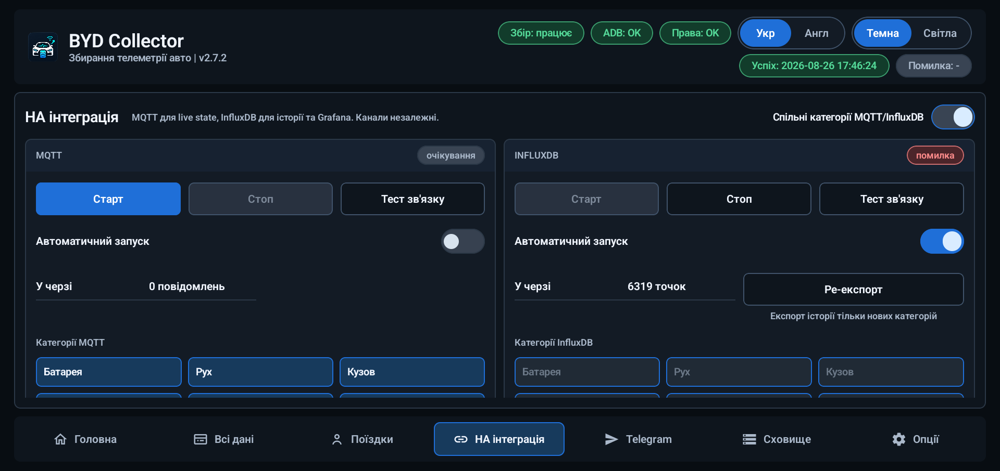
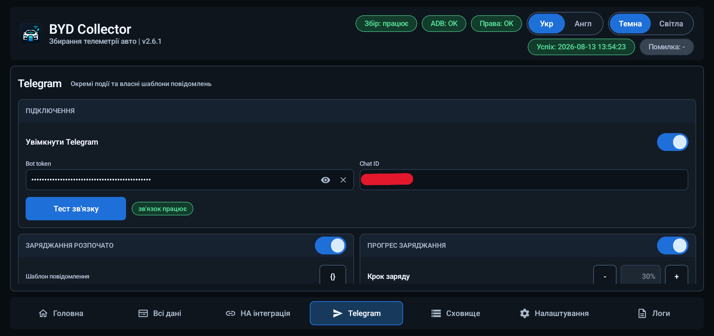
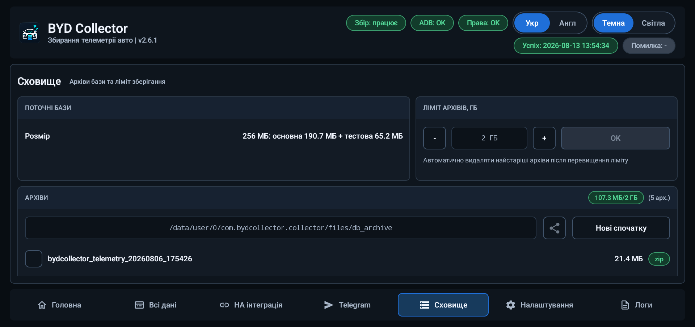
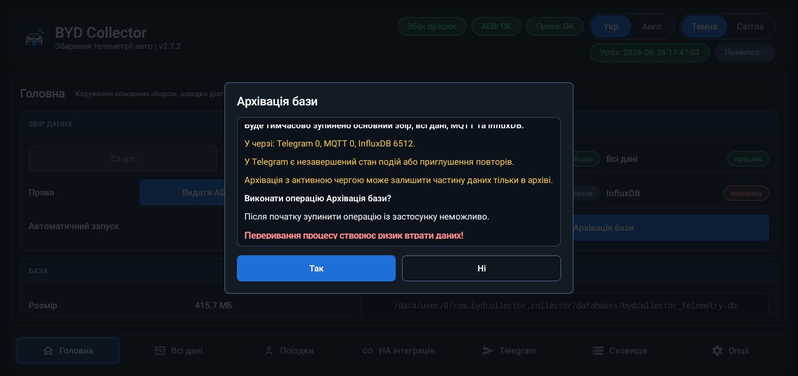
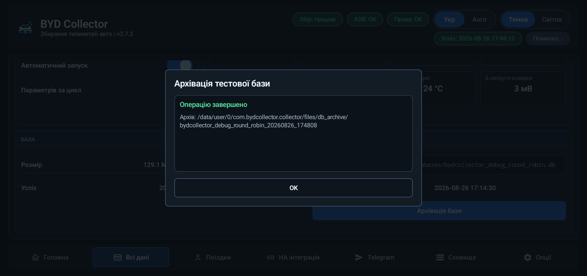
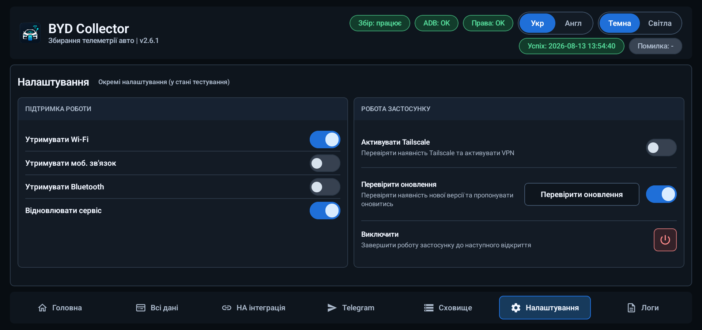

# BYD Collector

[English](README.md) | **Українська**

BYD Collector — застосунок для збору телеметрії автомобілів BYD китайського ринку з DiLink 5.0. Він читає дані автомобіля локально через ADB, зберігає сирі показники у SQLite та показує стан автомобіля й історію поїздок. За бажанням дані можна надсилати до MQTT/Home Assistant, InfluxDB і Telegram.

- **Основний автомобіль:** BYD Sea Lion 07 EV китайського ринку
- **Пакет:** `com.bydcollector.collector`
- **Завантаження:** [останній реліз на GitHub](https://github.com/sunlixWhyNotAvailable/byd-collector/releases/latest)
- **Допомога:** прочитайте [Усунення проблем](#усунення-проблем), потім [Повідомити про проблему](#повідомити-про-проблему)

> **Розкриття використання ШІ:** У цьому проєкті генеративні інструменти ШІ використовуються для аналізу коду й діагностичних логів, реалізації, тестування та підготовки документації.

Збирач є інженерним і дослідницьким інструментом, а не штатною діагностикою чи системою безпеки. Він ніколи не надсилає команд керування автомобілем.

## Як працює збір

Застосунок читає параметри автомобіля, не змінюючи їх. Сирі значення, доступні китайські назви й описи, час та інформація про якість даних зберігаються в локальній базі SQLite. На їхній основі формується стан автомобіля для інтерфейсу й увімкнених інтеграцій. Недоступні чи невідомі показники позначаються відповідно, а не видаються за достовірні.

Вибрана вкладка, позиції прокрутки та розгорнуті групи поїздок зберігаються протягом поточної сесії, зокрема при перемиканні вкладок або поверненні з іншого застосунку. Завершення через `Виключити` чи перезапуск процесу скидає навігацію.

Перемикач можна натиснути також через його підпис або рядок; для повідомлень Telegram — через заголовок секції. Щоб завершити редагування однорядкового поля, натисніть `Готово` на клавіатурі або приховайте її. У шаблонах Telegram Enter додає новий рядок, а приховування клавіатури завершує редагування.

## Можливості

| Напрям | Що доступно |
| --- | --- |
| Головна | Збір 95 відібраних параметрів автомобіля, автоматичний запуск, поточний стан та інформація про базу |
| Всі дані | Дослідницький збір із каталогу 23 083 сигнатур читання, сирі значення та запис змін |
| Стан автомобіля | SOC, SOH, запас ходу, пробіг, енергія батареї, заряджання, потужність, температури, двері, шини, клімат, швидкість та інші показники |
| MQTT / Home Assistant | MQTT Discovery Home Assistant і поточний стан вибраних категорій, основне й альтернативне з'єднання |
| InfluxDB | Історичний експорт до `InfluxDB v1` з автоматичними повторами та збереженням прогресу між сесіями |
| Telegram | Необов'язкові повідомлення про події, редаговані шаблони та збереження повідомлень, що очікують доставки |
| Поїздки | Локальна історія, GPS-маршрути, стиснення без втрат та мапа OpenStreetMap із кольорами за швидкістю або витратою |
| Сховище | Бази SQLite, ZIP-архіви, поширення й видалення архівів та спільний ліміт їхнього розміру |
| Фонова робота | Відновлення сервісу й з'єднань, опційна активація Tailscale та явне завершення роботи |
| Діагностика | Локальні журнали подій, опційний повносистемний logcat, поширення ZIP та очищення логів |

Інтерфейс доступний англійською та українською мовами, у темній і світлій темах.

## Вкладка «Головна»

`Головна` керує звичайним збором телеметрії. Запустіть його після авторизації ADB або увімкніть автоматичний запуск.

- Збирає 95 відібраних параметрів автомобіля лише для читання.
- Показує стан збору, MQTT та InfluxDB, останній успіх, останню помилку й помилки сесії.
- Відображає SOC, SOH, пробіг, температури салону й батареї, заряджання/розряджання, запас ходу, різницю напруги комірок і підсумки категорій.
- Зберігає сирі показники та нормалізовану історію локально. Історія автоматично не видаляється й не скорочується.

Зібрані дані включають режим заряджання та зарядний стан батареї, тип зарядного роз'єму, відсоток відкриття всіх чотирьох вікон, оцінку залишку парфуму та стан встановлення трьох слотів. Прогнозований автомобілем залишок часу заряджання експортується одним значенням `hh:mm:ss`; недоступні показники не видаються за нуль. Показники струму переднього й заднього моторів залишаються сирими значеннями без одиниці виміру, оскільки фізичні одиниці ще не підтверджені. Ці поля доступні для MQTT та InfluxDB через відповідні вибрані категорії.

Деякі поля мають відомі обмеження: сирий `CHARGING_STATE` недостовірний і не використовується для визначення заряджання в експорті чи Telegram. Зарядні повідомлення враховують підтверджений зарядний стан батареї разом із роз'ємом і потужністю; якщо стан батареї недоступний, використовуються роз'єм і потужність. Підтверджений повний заряд має пріоритет над повідомленням про зупинку. Для `max_discharge_power_allow_raw` одиниця виміру та масштаб у кВт не підтверджені, а коди положення люка/шторки не можна трактувати просто як «відкрито/закрито».

Натисніть `Стоп`, коли збір більше не потрібен. Фонову роботу та залежні від автомобіля обмеження описано в розділі [Відомі обмеження](#відомі-обмеження).

## Вкладка «Всі дані»

`Всі дані` призначена для дослідження та діагностики. Її можна запускати окремо, коли основний сервіс збору доступний.

Компактні картки стану авто показують також відсоток залишку всіх трьох слотів парфуму. Валідний нуль відображається як нуль, а недоступні показники залишаються відмінними від нього.

- Читає дослідницький каталог із 23 083 сигнатур лише для читання.
- Зберігає сирі значення, описи, якість даних і зміни в окремій базі.
- Допомагає знаходити поля, що змінюються, але сама зміна ще не доводить значення поля.

Такий збір може займати значний обсяг сховища. Зупиняйте його після дослідницької сесії та за потреби архівуйте базу. Зупинка `Всі дані` не зупиняє основний збір.

## Поїздки та маршрути

Вкладка `Поїздки` зберігає сесії від увімкнення до вимкнення автомобіля в окремій локальній базі. Вона містить підсумки й GPS-маршрути, а не дублює всю телеметрію. Сесії без руху приховані зі звичайного списку.

Таблиця окремо показує витрачену з АКБ енергію, рекуперовану під час руху та баланс АКБ (витрачено мінус рекуперовано). Середня витрата рахується за балансом і може бути від’ємною. Ці розрахункові значення також доступні в категорії «Батарея» для MQTT та InfluxDB. Пропуски не заповнюються припущеннями про потужність; неповне покриття позначається як часткове. Старі поїздки автоматично не перераховуються, а відсутні нові значення показуються прочерком.

`Поточна поїздка` поруч зі стисненням відкриває метрики й мапу активної сесії. Вікно оновлюється, поки видиме, без скидання положення чи масштабу мапи. Метрики доступні й без GPS; активна поїздка не має позначки фінішу. Після завершення у вікні залишається ця сама поїздка.

Запис маршруту потребує дозволу Android на локацію. Якщо відхилити запит першого запуску, доступ можна надати пізніше в системних налаштуваннях. Недовірені GPS-показники, зокрема неправдоподібні стрибки чи швидкість, не потрапляють на маршрут. Втрата сигналу або відхилені точки можуть залишати розриви; лінія через відхилені точки не прокладається.

Мапа використовує онлайн-тайли OpenStreetMap і кольори за швидкістю або миттєвою витратою. Чорний контур допомагає відрізнити маршрут від об'єктів мапи. Маркери початку й кінця мають відповідну легенду. Сірі ділянки витрати означають відсутність даних, а не нуль. Пороги кольорів налаштовуються; за замовчуванням це `90/30 км/год` для швидкості та `15/20 кВт·год/100 км` для витрати.

Стиснення маршрутів у вкладці «Поїздки» зменшує розмір сховища без втрати поїздок, точок чи мап. Поточна поїздка продовжує записуватися. Це не архівація й не видалення; історія поїздок автоматично не очищається.

## MQTT, Home Assistant та InfluxDB

Вкладка `HA інтеграція` налаштовує два незалежні канали експорту. Проблема зі з'єднанням не зупиняє локальний збір.

Кожен канал підтримує основні хост/порт і необов'язкові альтернативні хост/порт для доступу до того самого сервера, наприклад через домашню мережу або VPN. Підписи показують профіль редагування та з'єднання, що зараз використовується. Поля з'єднання й вибір профілю заблоковані, доки канал запущений, зокрема під час очікування повтору; перед редагуванням зупиніть канал. `Тест зв'язку` перевіряє лише вибраний профіль і не перемикає активне з'єднання.

### MQTT та Home Assistant

- Публікує MQTT Discovery-конфігурацію Home Assistant і поточний стан автомобіля.
- Підтримує категорії батареї, руху, кузова, клімату, безпеки та локації.
- Експорт локації за замовчуванням вимкнений і не залежить від локального запису маршрутів.
- Налаштовуються хост/порт брокера, необов'язкові альтернативні хост/порт, спільні облікові дані, client ID, префікс топіків і discovery-префікс.
- Спочатку використовується основне з'єднання, за помилок зв'язку — альтернативне. Робоче з'єднання зберігається; помилки автентифікації, TLS і даних потребують уваги, а не перемикання профілів.
- Невдалі публікації повторюються автоматично. MQTT передає поточний стан, тому під час недоступності брокера оновлення можуть бути пропущені; локальна історія SQLite зберігається.

### InfluxDB

- Експортує історію автомобіля до `InfluxDB v1` для графіків і Grafana.
- Хост/порт сервера, необов'язкові альтернативні хост/порт, база, measurement, облікові дані та категорії налаштовуються окремо від MQTT.
- Експорт локації за замовчуванням вимкнений. Після ввімкнення довірені координати передаються з початковими часовими мітками.
- Прогрес експорту зберігається, а решта історії передається після відновлення зв'язку. Для великих черг використовуються більші пакети, розмір яких коригується після тимчасових помилок.
- Робоче з'єднання зберігається; альтернативне використовується за мережевих і деяких тимчасових серверних помилок. Помилки автентифікації, TLS, даних та обмеження частоти запитів не спричиняють перемикання.
- Підтверджений некоректний запис ізолюється без видалення його сирої локальної історії та без блокування інших полів.

Захищайте сервер і облікові дані в мережі, де використовується збирач.

## Telegram-повідомлення

Telegram необов'язковий і за замовчуванням вимкнений. Застосунок надсилає текстові повідомлення через вашого бота; він не приймає віддалених команд і не завантажує зображення маршрутів.

Налаштуйте токен бота, chat ID, перемикачі подій, затримки й шаблони у вкладці `Telegram`, потім натисніть `Тест зв'язку`. Облікові дані захищаються засобами Android Keystore та маскуються в інтерфейсі.

Доступні повідомлення:

- початок заряджання, прогрес заряджання, заряджено до 100% і завершення заряджання;
- підключення та відключення зарядного пістолета;
- низька напруга 12 V акумулятора;
- недоступна телеметрія; і
- підсумок поїздки.

Вбудовані шаблони змінюються разом із мовою застосунку. Ваш власний текст і збережені налаштування зберігаються. Редактор пропонує змінні для доступних показників і попереджає про ліміт Telegram у 4 096 символів, зокрема коли його перевищують посилання локації.

Звіти про заряджання можуть містити SOC, енергію, потужність, локальний час події (`dd.MM.yyyy HH:mm`) і тривалість кроку/сесії. Звіт про 100% містить зафіксовані початок, завершення та доданий заряд. Якщо збір розпочався посеред заряджання, звіт охоплює лише спостережену частину. Стандартний поріг низької напруги — `12,5 V`, крок налаштування — `0,1 V`.

**Підсумки поїздок**

- Окремий переїзд завершується після перебування в `P` протягом налаштованої затримки: 5–300 секунд, за замовчуванням 10 секунд. Коротша зупинка залишається частиною того самого переїзду.
- Перший валідний показник вимкнення авто запускає негайну спробу надсилання без очікування затримки паркування. Доставка все одно залежить від зв'язку.
- Поточна статистика показує витрачену й рекуперовану енергію цього переїзду, баланс АКБ із середньою витратою за балансом та початковим/кінцевим SOC. Загальна статистика охоплює сесію від увімкнення авто, включно зі споживанням на стоянках; SOC блоку «Загалом» — від першого переїзду до останнього показника. Часткова енергія явно позначається. Розпізнані default-шаблони оновлюються автоматично; власний текст і значення старих змінних енергії зберігаються.
- Блок «Загалом» не показується, якщо дублює єдину поїздку. Відмінні підсумки або зміна SOC на стоянці залишають його видимим.
- Для підсумку потрібна зміна SOC щонайменше на 1%, відстань понад 0,1 км або енергія понад 0,1 кВт·год.

**Посилання локації**

Надсилання локації за замовчуванням вимкнене. Відкрийте `Надсилати локацію` та виберіть Google, Waze, Apple та/або OSM. Посилання надсилаються під час вимкнення авто, а не зі звичайним підсумком за затримкою паркування.

Якщо під час вимкнення GPS недоступний, застосунок використовує останню довірену точку цієї поїздки/сесії. Це може бути місце останнього прийому сигналу, а не кінцеве місце паркування. Без довіреної точки посилання не надсилається; сам підсумок усе одно може бути доставлений.

Якщо підсумок паркування вже надіслано, локація приходить окремим повідомленням після вимкнення. Якщо наступний переїзд дає новий фінальний підсумок, посилання додаються до нього. Короткий фінальний переїзд, замалий для нового підсумку, не скасовує попереднє очікування локації.

**Доставка та зберігання**

Ненадіслані повідомлення зберігаються після перезапусків і архівації баз «Головна»/«Всі дані». Мережеві помилки повторюються автоматично; увімкнення авто, суттєві зміни мережі та успішний тест зв'язку можуть запустити нову спробу. За тривалої недоступності паузи зростають від 30 секунд до 30 хвилин. Власні серверні обмеження Telegram залишаються чинними.

Повідомлення, що очікує або має помилку, не блокує інші готові повідомлення, але окрема локація чекає доставки свого підсумку. Після запуску Telegram відлік недоступності телеметрії починається заново, без негайного сповіщення про стару перерву.

Черга обмежена 1 000 повідомлень. Повідомлення, для яких уже була спроба надсилання, можуть видалятися після 30 днів. Помилка сховища Telegram призупиняє Telegram, але не локальний збір. Черга повідомлень зберігається окремо від архівів баз і діагностичних ZIP; `Очистити логи` її не видаляє.

## Сховище та архіви

Телеметрія й поїздки зберігаються локально у SQLite. Бази «Головна» та «Всі дані» можна архівувати в ZIP, щоб почати запис у нову базу.

- `Сховище` показує сумарний розмір баз «Головна», «Всі дані» та «Поїздки», включно із супутніми файлами, а також розмір/кількість архівів і спільний ліміт.
- Виберіть наявні архіви, щоб поділитися ними або видалити після підтвердження. Видалення показує прогрес і повідомляє про файли, які не вдалося прибрати.
- Ліміт архівів стосується готових архівів «Головна»/«Всі дані», а не активних баз чи поїздок. Автоматичне очищення прибирає старіші архіви, захищаючи найновіший архів кожного типу.
- Для поїздок використовується стиснення без втрат замість архівації. Історія основної бази та поїздок автоматично не видаляється.
- Якщо потрібне оновлення формату основної чи дослідницької бази, наявна база архівується перед заміною. Оновлення бази поїздок зберігає історію.

Ручна архівація також дозволяє відновити роботу, коли база більше не працює нормально. Невдалі попередні перевірки показуються як попередження; операція все ж зупиняється, якщо не вдається зберегти вихідну базу або створити придатну нову.

Архівація може тимчасово зупинити збір та інтеграції. Уважно прочитайте підтвердження, особливо попередження про черги MQTT/InfluxDB або стару чергу Telegram, що очікує перенесення. Не переривайте архівацію. Архівація баз «Головна» чи «Всі дані» не видаляє поточну чергу повідомлень Telegram.

  
  

## Опції та робота застосунку

В `Опціях` доступні перевірки ADB та керування фоновою роботою, відновлення з'єднань, активація Tailscale, перевірка оновлень і засоби логування. Перемикачі автоматичного запуску на вкладках збору та інтеграцій керують відповідними функціями.

- Використовуйте налаштування фонових застосунків і перевірки ADB, щоб дозволити збір.
- Увімкніть `Відновлювати Wi-Fi та моб. зв'язок` для спільного відновлення цих з'єднань або окремо відновлення Bluetooth.
- Відновлення Bluetooth запитує ввімкнення лише коли Bluetooth вимкнений, а автомобіль підтверджено вимкнений. Коли авто ввімкнене або його стан живлення невідомий, такий запит не виконується.
- Відновлення сервісу допомагає застосунку повертатися після підтримуваних завершень процесу або перезавантажень. Дозвіл доступу до сповіщень використовується для фонового відновлення, а не читання вмісту сповіщень.
- Опційна активація Tailscale може допомогти дістатися налаштованого сервера через VPN.
- Натисніть `Виключити`, щоб зупинити роботу до наступного відкриття застосунку.

Ці дії відновлюють Android-сервіси та з'єднання; вони не надсилають команд керування автомобілем.

Автономний телеметричний хелпер запитує в Android утримання процесора активним під час своєї роботи, зокрема з вимкненим екраном. Якщо запит не вдається, збір продовжується без цього захисту. Це не запобігає завершенню процесу Android чи перезавантаженню автомобіля; вплив на роботу припаркованого авто ще потребує перевірки на машині.

Автоматична перевірка оновлень починається після короткої стартової паузи й може виконуватися під час фонової роботи застосунку. Коли Collector видимий, доступне оновлення пропонується у самому застосунку. Закриття пропозиції оновлення призупиняє автоматичні перевірки на годину або до нової сесії застосунку. Ручна перевірка залишається доступною й завжди перевіряє останній опублікований реліз.

`Віджет-підказка нової версії` початково ввімкнений. Якщо фонова перевірка знаходить оновлення, підказка може з'явитися поверх інших застосунків на 10 секунд. Натисніть її, щоб відкрити `Опції` та збережену пропозицію оновлення, або закрийте хрестиком. Повернення до Collector прибирає його підказку без повторної перевірки; згортання не показує стару підказку знову. Кнопка налаштувань поруч із перемикачем дозволяє змінити розмір, прозорість, заокруглення й колір рамки та риски; початковий колір акценту — зелений.

Для підказки потрібен дозвіл Android на показ поверх інших застосунків. Без нього звичайні пропозиції оновлення та збір працюють і далі. Із сумісними версіями BYD HUD та BYD Extend підказки займають доступні місця на екрані й за потреби тимчасово зменшуються; кожна зберігає власний час показу та користувацькі налаштування оформлення.

## Діагностика та приватність

Застосунок веде локальний журнал робочих подій окремо від баз телеметрії. Для відтворюваної проблеми натисніть `Старт logcat` у `Опції -> Підтримка роботи`, відтворіть проблему й зупиніть запис. Повносистемний запис потребує авторизації ADB та обмежений 128 МіБ; звичайний журнал подій — 8 МіБ.

`Поділитись логами` створює свіжий ZIP і відкриває системне вікно поширення Android лише з файлом. Архів містить інформацію про застосунок/пристрій, останні робочі події, доступні системні й фонові логи та діагностичні підсумки InfluxDB, поїздок і Telegram. Відсутні джерела позначаються, не блокуючи решту архіву. Бази телеметрії й Telegram не додаються. Для створення ZIP потрібне додаткове вільне місце; за помилки наявні логи й попередній придатний архів зберігаються.

До архіву також входять доступні журнали запуску телеметричного хелпера та підсумок заповнення буфера телеметрії, імпорту й звільнення місця. Ці діагностичні журнали обмежені за розміром; їх можна очистити без видалення ще не імпортованої телеметрії та скидання актуального підсумку заповнення.

`Очистити логи` запитує підтвердження, видаляє завершені записи й сформовані архіви та скидає журнал подій, не зупиняючи активний logcat. Недоступні логи фонового сервісу можуть дати частковий результат очищення. Нещодавно поширена копія може тимчасово залишатися, щоб застосунок-одержувач устиг її прочитати. Архіви баз, історія поїздок і повідомлення Telegram у черзі не очищаються.

Перед поширенням у діагностичних копіях маскуються розпізнані облікові дані, явно позначені координати та приватні ідентифікатори автомобіля/чату/акаунта. Версії застосунку й прошивки, назви автомобілів, хости/IP-адреси та порти залишаються читабельними для діагностики. Оригінальні логи й архіви баз не змінюються. **Ця фільтрація не гарантує анонімності повносистемних логів.**

Перевіряйте ZIP перед передаванням: системні та фонові логи все ще можуть містити приватну інформацію чи дані інших застосунків. Архіви баз поширюються окремо через `Сховище` й можуть містити сиру телеметрію, поїздки та координати.

Діагностика залишається на пристрої, доки ви не вирішите нею поділитися. Застосунок автоматично не надсилає телеметрію, скріншоти, звіти про збої чи логи у проєкт. MQTT, InfluxDB і Telegram — призначення, які ви налаштовуєте й вмикаєте самі. Повна політика обробки даних — у файлі [PRIVACY](PRIVACY.uk.md).

## Встановлення та ADB

### Вимоги

- Android 8.0 (API 26) або новіший;
- сумісний автомобіль BYD китайського ринку з DiLink 5.0;
- дозвіл на встановлення APK на планшеті автомобіля; та
- локальний доступ ADB до планшета автомобіля.

### Перше налаштування

1. Завантажте актуальний APK зі сторінки [GitHub Releases](https://github.com/sunlixWhyNotAvailable/byd-collector/releases/latest) і перевірте контрольну суму релізу, якщо її опубліковано.
2. Встановіть і відкрийте **BYD Collector** на планшеті автомобіля.
3. Виконайте підказку першого запуску для фонових застосунків і встановіть `Disable background Apps -> BYD Collector` у `OFF`.
4. Дозвольте Android доступ до локації, якщо потрібен запис маршрутів. Після відмови надайте доступ пізніше в системних налаштуваннях; застосунок не повторює запит циклічно.
5. Коли Android покаже запит RSA для ADB, підтвердьте його. У застосунку натисніть `Grant ADB`, щоб повторно перевірити міст.
6. Запустіть `Головна` і переконайтеся, що стан змінився з очікування на успішний збір.
7. Увімкніть вимкнену за замовчуванням категорію `Локація` лише для тих каналів MQTT/Influx, яким потрібен експорт точних координат.
8. Увімкніть лише потрібні інтеграції та події Telegram і перевірте кожне з'єднання на його вкладці.
9. Запускайте `Всі дані` лише для дослідницьких сесій: він записує окрему, значно більшу базу.

Авторизація ADB потрібна для збору свіжої телеметрії автомобіля. Без неї можна переглядати збережені дані, налаштування та архіви. Повторно авторизуйте доступ після скидання планшета або нового запиту Android.

## Усунення проблем

### Вкладка «Головна» залишається в `waiting` або показує помилку `ADB`/прав

- Переконайтеся, що планшет не спить, а локальний міст ADB авторизований.
- Натисніть `Grant ADB` і повторно прийміть RSA-запит, якщо Android його показує.
- Встановіть `Disable background Apps -> BYD Collector` у `OFF`.
- Зупиніть іншу копію збирача або застосунок, який може використовувати локальний ADB-сеанс, і запустіть `Головна` знову.
- Запустіть logcat у `Опції -> Підтримка роботи`, відтворіть проблему, а потім зупиніть запис, щоб завершити діагностичний архів.

### Вкладка «Головна» успішна, але значення порожнє, застаріле або невідоме

Автомобіль може не надавати поле, читання може бути неповним або значення поля ще не підтверджене. Сирі показники та інформація про якість залишаються доступними для аналізу. Числовий код одного поля не обов'язково означає те саме в іншому.

### Вкладка «Всі дані» повільна або сховище швидко зростає

`Всі дані` навмисно опитує дослідницький каталог і зберігає сирі докази. Зупиніть її після сесії, потім скористайтеся дією `Архівація тестової бази` у вкладці «Всі дані»; `Сховище` призначене для поширення або видалення вже створених архівів. Передавайте лише потрібний архів, якщо повідомляєте про знахідку.

### Home Assistant або MQTT офлайн

Перевірте хост/порт вибраного профілю, облікові дані, префікси топіків/discovery та категорії. `Тест зв'язку` перевіряє лише цей профіль. Альтернативне з'єднання допомагає за мережевих проблем, але не за неправильних облікових даних чи даних експорту. MQTT надсилає поточний стан, тому без зв'язку оновлення можуть бути пропущені. Локальний збір працює незалежно.

### InfluxDB відстає або показує повторні спроби

Перевірте вибраний профіль, облікові дані, базу/measurement, категорії та VPN, якщо він потрібен. Натисніть `Тест зв'язку` й порівняйте активне з'єднання з перевіреним профілем. Успішний тест або цикл збору не означає, що вся черга вже експортована. Прогрес зберігається, повтори автоматичні; якщо черга не зменшується, поділіться діагностичними логами та вкажіть приблизний час проблеми.

### Telegram затримує або не надсилає повідомлення

Перевірте токен бота й chat ID через `Тест зв'язку` та увімкніть потрібну подію. Успішний тест може відновити доставку після мережевих помилок, коли Telegram увімкнено, але не скасовує серверну паузу Telegram. Якщо немає локації, перевірте вибрані навігатори та наявність хоча б однієї довіреної GPS-точки за поїздку. За тривалих збоїв поділіться діагностичними логами й приблизним часом події.

### Архів відкладено або обслуговування не запускається

Прочитайте попередження в підтвердженні про черги експорту чи старі повідомлення Telegram, що очікують перенесення. За можливості дочекайтеся завершення експорту. Якщо звичайний збір заблокований проблемою бази, скористайтеся її ручною архівацією, щоб зберегти старі дані й почати новий запис. Не переривайте активну архівацію.

## Повідомити про проблему

Оберіть відповідну форму для проблеми:

- [Повідомити про помилку](https://github.com/sunlixWhyNotAvailable/byd-collector/issues/new?template=bug_report.yml) для відтворюваних збоїв або некоректної поведінки;
- [Запропонувати вдосконалення](https://github.com/sunlixWhyNotAvailable/byd-collector/issues/new?template=suggestion.yml) для нового сценарію чи продуктової зміни; або
- відкрийте [сторінку створення проблеми](https://github.com/sunlixWhyNotAvailable/byd-collector/issues/new/choose) і оберіть проблему у вільній формі, якщо жодна структурована форма не підходить.

Форма помилки запитує:

- версію збирача та джерело APK;
- модель/рік автомобіля, ринок, версію DiLink і прошивку планшета;
- інформацію, чи був ADB авторизований, і яка вкладка/статус не працює;
- приблизний локальний час, очікувану та фактичну поведінку; і
- найменший доречний вибраний архів бази або діагностики після видалення секретів і зайвих поїздок.

Для проблеми збору один раз відтворіть її із запущеним повносистемним logcat. Для інтеграції додайте стан каналу та спосіб підключення без облікових даних. Для дослідницької знахідки створіть проблему у вільній формі, додайте архів `Всі дані` й опишіть, як значення змінювалося; сама зміна не доводить його зміст.

Архіви можуть містити ідентифікатори автомобіля, сирі китайські описи, час, поїздки та дані, пов'язані з місцем. Перегляньте попередження й передайте мінімально необхідне.

## Відомі обмеження

- Переважно перевірено на китайському `BYD Sea Lion 07 EV 2025` із `DiLink 5.0`; інші автомобілі та прошивки можуть надавати інші дані чи мати іншу поведінку.
- Телеметрія доступна лише для читання; команди керування автомобілем не підтримуються.
- Після скидання чи оновлення прошивки може знадобитися відновлення авторизації ADB та фонових дозволів.
- «Всі дані» — дослідницький каталог, а не гарантія доступності й зрозумілого значення кожного поля.
- Активна історія основної бази та поїздок може продовжувати зростати. Стежте за сховищем, за потреби архівуйте основну базу та стискайте завершені маршрути.
- Подавлення GPS або поганий прийом можуть залишати розриви маршруту; онлайн-мапа потребує інтернету.
- На перевіреному автомобілі спостерігався збір після його вимкнення, зокрема після зупинки процесу застосунку. Перезавантаження планшета/ядра перериває збір; відновлення залежить від Android і прошивки автомобіля.
- MQTT може пропускати поточні оновлення без зв'язку. InfluxDB передає історію поступово, а доставка Telegram залежить від доступності мережі й сервера.
- Tailscale необов'язковий і не потрібен для локального збору; його робота залежить від мережевих обмежень автомобіля.

## Перевірений пристрій

| Автомобіль | Ринок | DiLink | Стан |
| --- | --- | --- | --- |
| BYD Sea Lion 07 EV 2025 | Китай | 5.0 | Перевірено розробником |

Збирач може працювати на інших BYD китайського ринку, але доступні параметри та їхні значення потрібно перевіряти окремо.

## Ліцензія та застереження

BYD Collector розповсюджується за ліцензією [GNU Affero General Public License v3.0](LICENSE).

Це незалежний проєкт. Він не пов'язаний із BYD, DiLink, MQTT, Home Assistant, InfluxDB, Telegram або виробником автомобіля, не схвалений і не фінансується ними. Назви продуктів і торговельні марки належать відповідним власникам.

Використовуйте програмне забезпечення на власний ризик. Телеметрія може бути неповною, затриманою, застарілою або помилковою; її не можна використовувати як критично важливе для безпеки чи юридично авторитетне джерело. Не відволікайтеся від дороги й встановлюйте, налаштовуйте або діагностуйте систему лише під час стоянки.
