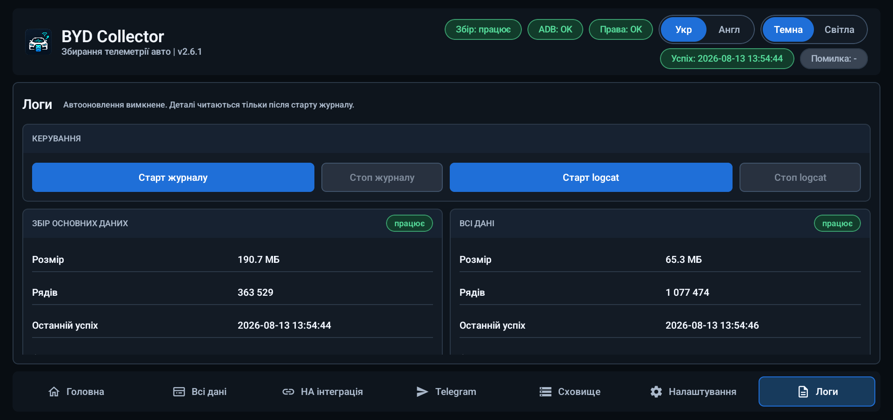

# BYD Collector

[English](README.md) | **Українська**

BYD Collector — це збирач телеметрії лише для читання для автомобілів BYD китайського ринку з DiLink 5.0. Він читає значення автомобіля через локальний міст ADB Android і helper `app_process`, що належить APK, зберігає сирі показники у SQLite, будує нормалізований стан автомобіля та, за бажанням, експортує його до MQTT/Home Assistant, InfluxDB і Telegram.

- **Основний автомобіль:** BYD Sea Lion 07 EV китайського ринку
- **Поточна версія вихідного коду:** кандидат `v2.7.0`; останній опублікований реліз: `v2.6.3`
- **Пакет:** `com.bydcollector.collector`
- **Завантаження:** [останній реліз на GitHub](https://github.com/sunlixWhyNotAvailable/byd-collector/releases/latest)
- **Допомога:** прочитайте [Усунення проблем](#усунення-проблем), потім [Повідомити про проблему](#повідомити-про-проблему)

> **Розкриття використання ШІ:** У цьому проєкті генеративні інструменти ШІ використовуються для аналізу коду й діагностичних логів, реалізації, тестування та підготовки документації.

Збирач є інженерним і дослідницьким інструментом, а не штатною діагностикою чи системою безпеки. Він ніколи не надсилає команд керування автомобілем.

## Як працює збір

Виробничий шлях навмисно локальний і доступний лише для читання:

1. Android-застосунок перевіряє локальний міст ADB і запускає запакований helper через class path застосунку.
2. Helper використовує лише дозволені getter-транзакції (`5` і `7`) та фіксований список читання.
3. Кожен poll зберігає сире значення, назву поля, китайську назву/опис (якщо доступні), якість, час виконання, стан застарілості/помилки та метадані часткового успіху у SQLite.
4. Нормалізовані поля виводяться із сирого запису для інтерфейсу та інтеграцій. Невідомі поля й значення залишаються доступними для запитів; значення enum не вважаються глобально однаковими, а трактуються окремо для кожного поля.

Старий HTTP-збирач Di+ є лише дослідницьким контекстом. Він не є виробничим транспортом і не потрібен цьому APK.

Інтерфейс зберігає останній знімок dashboard у спільному кеші процесу. Тому під час відкриття чи відновлення застосунку та перемикання вкладок останній відомий стан показується одразу, а цільові фонові оновлення замінюють лише дані, які справді можуть змінитися. Значення KPI та прирости лічильників рядків надходять безпосередньо з успішного збору/запису; повний підрахунок SQLite використовується лише для початкової базової точки або її відновлення після обслуговування бази.

## Можливості

| Напрям | Що доступно |
| --- | --- |
| Транспорт лише для читання | Локальний ADB і версійований helper `app_process` зі списком дозволених читань, що належить APK |
| Вкладка «Головна» | Старт/стоп основного read-only poll для 82 полів, автоматичний запуск, поточний стан, стан бази та швидка діагностика |
| Вкладка «Всі дані» | Round-robin-дослідження повного каталогу з 23 096 сигнатур, сирі значення та докази змін/переходів |
| Нормалізований стан | SOC, SOH, запас ходу, пробіг, енергія батареї, заряджання, потужність, температури, двері, шини, клімат, швидкість, радари та пов'язані поля |
| MQTT / Home Assistant | MQTT Discovery Home Assistant і поточні live-топіки для вибраних категорій |
| InfluxDB | Незалежний історичний експорт до `InfluxDB v1` зі стійкими курсорами та станом повторних спроб |
| Telegram | Необов'язкові повідомлення про події з редагованими шаблонами та довговічною FIFO-чергою |
| Поїздки | Окрема локальна історія поїздок, GPS-маршрути, налаштування кольорів швидкості/витрати та онлайн-мапа OpenStreetMap |
| SQLite й архіви | Сховища compact-v2 для сирих/нормалізованих даних, безпечне перемикання баз, ZIP-архіви, поширення та спільний ліміт архівів |
| Runtime | Відновлення у фоні, опційна активація Tailscale, утримання мережі/Bluetooth і явне завершення роботи |
| Діагностика | Локальний журнал і запис logcat, історія станів/помилок та поширення вибраних архівів |

Інтерфейс доступний англійською та українською мовами й підтримує темну та світлу теми.

## Вкладка «Головна»

`Головна` керує виробничим poll. Запустіть її після авторизації ADB або увімкніть автоматичний запуск для підтримуваних подій завантаження й runtime.

- Поточний основний каталог містить 82 direct-поля, включно з read-only кандидатом межі живлення.
- Один від'єднаний helper ексклюзивно виконує main-читання: кожні 500 мс, поки застосунок отримує його Binder-spool, і кожні 5 секунд без застосунку. Застосунок ідемпотентно імпортує кожен незмінний sample перед підтвердженням; навмисні `Stop`/`Shutdown` зупиняють worker, а звичайна загибель процесу застосунку залишає збір активним до відновлення або kernel reboot.
- Цілі й дробові значення читаються згрупованими native-запитами, де це можливо; зберігаються впорядковані результати, а helper має scalar fallback.
- Картка стану показує polling, MQTT та InfluxDB, останній успіх, останню помилку й помилки сесії.
- Картки нормалізованого стану показують поточні SOC, SOH, пробіг, температуру салону й батареї, заряджання/розряджання, запас ходу, різницю напруги комірок і підсумки категорій.
- Сирі main-poll залишаються джерелом істини. Історія нормалізованих даних зараз lossless і не має автоматичного строку зберігання чи downsampling.

Натисніть `Stop` перед обслуговуванням або коли автомобіль більше не потрібно опитувати. Невдалий чи неповний poll записується саме як такий; інтерфейс не перетворює невідоме значення на дійсне.

## Вкладка «Всі дані»

`Всі дані` — це дослідницький/debug-канал. Його можна запускати окремо після доступності основного runtime.

- Повний каталог зараз містить 23 096 read-only сигнатур.
- Round-robin-цикл надсилає каталог одним запитом до helper із наявним інтервалом 500 мс; він не ділиться на довільні runtime-кроки по 10 000 записів.
- Сирі значення, описи, якість і докази змін/переходів зберігаються в окремій round-robin-базі.
- Цей канал допомагає знаходити поля, що змінюються. Сама зміна не підтверджує значення поля; для підняття поля до нормалізованого каталогу потрібні окремі докази.

Перед запуском debug-сесії round-robin-сховище перемикається та перевіряється. Зупинка цього каналу не змінює основний poll.

## Поїздки та маршрути

Вкладка `Поїздки` зберігає сесії від увімкнення до підтвердженого вимкнення живлення в окремій приватній базі `bydcollector_trips.db`. Вона містить лише підсумки поїздок і GPS-точки/розриви маршруту та не дублює повний каталог main-телеметрії. Сесії без руху зберігаються, але не показуються у звичайному списку.

Маршрут записується через Android GPS після надання дозволу на локацію. Мапа використовує онлайн-тайли OpenStreetMap, показує розриви замість вигаданих координат, вміщує весь маршрут і може фарбувати сегменти за швидкістю або миттєвою витратою. За замовчуванням використовується швидкість із порогами `90/30 км/год`; пороги витрати — `15/20 кВт·год/100 км`.

Автоматичного retention маршрутів і дії архівування бази поїздок наразі немає. Її реальний розмір разом із WAL буде виміряно після кількох днів, перш ніж обирати політику зберігання.

## MQTT, Home Assistant та InfluxDB

Вкладка `HA інтеграція` налаштовує два канали експорту поза автомобілем. Вони незалежні: проблема одного каналу не робить успішний main-poll невдалим.

### MQTT та Home Assistant

- Публікує MQTT Discovery-конфігурацію Home Assistant і поточний нормалізований стан автомобіля.
- Дозволяє обирати категорії: батарея, рух, кузов, клімат, безпека та асистенти водія.
- Точна локація має окремий перемикач і за замовчуванням вимкнена незалежно від звичайних категорій.
- Налаштовуються host, port, username/password, client ID, префікс топіків і discovery-префікс.
- MQTT призначений для поточного стану. Якщо брокер Home Assistant недоступний, live-стан може бути пропущений; SQLite залишається локальним джерелом істини.
- Після невдалої публікації повтор стає дозволеним через 30 секунд. Вихідний код `v2.7.0` планує один збережений single-flight повтор точно на цей дедлайн; опублікована збірка `v2.6.3` іще чекає наступного оновлення стану або status heartbeat.

### InfluxDB

- Експортує нормалізовану історію до `InfluxDB v1` для довгих графіків і Grafana.
- Host, port, база даних, measurement, облікові дані та категорії налаштовуються незалежно від MQTT.
- Історія точної локації має окремий перемикач і за замовчуванням вимкнена.
- Для кожного вибраного поля зберігається курсор. Експорт працює незалежно від main-poll, поки живий сервіс: успішні глобально впорядковані пакети містять до 300 рядків і продовжуються раз на секунду, доки є черга; реальна помилка запису використовує 30-секундну затримку повтору.
- `Re-export` доступний після ввімкнення нових категорій; поточні курсори запобігають дублюванню історії у звичайному режимі.

Безпека транспорту та розгортання TLS є окремими рішеннями інтеграції. Захищайте endpoint і облікові дані у своїй мережі.

## Telegram-повідомлення

Telegram є необов'язковим і після чистого встановлення вимкнений. Застосунок надсилає лише текст через Telegram Bot API; він не приймає команди, не реєструє webhook, не опитує оновлення й не надсилає медіа.

У вкладці `Telegram` налаштовуються bot token, chat ID, перемикачі подій, затримки та шаблони повідомлень. Секрети зберігаються через Android Keystore, за замовчуванням маскуються й можуть бути явно очищені.

Доступні шаблони подій:

- початок заряджання, прогрес заряджання, заряджено до 100% і завершення заряджання;
- підключення та відключення зарядного пістолета;
- низька напруга 12 V;
- недоступна телеметрія; і
- підсумок поїздки.

Шаблони прогресу заряджання можуть показувати додані енергію/SOC за поточний крок і підсумок усієї сесії. Підсумок поїздки розділяє поточну поїздку `P -> non-P -> P` та загальні значення поточного запуску автомобіля. Підсумок доступний за зміни SOC щонайменше на 1%; інакше поїздка має перевищити 0,1 км або 0,1 кВт·год. Припаркований підсумок зберігається, а продовження руху скасовує застаріле завершення. Підтверджене вимкнення автомобіля обходить затримку паркування: підсумок одразу ставиться в чергу та виконується спроба надсилання, поки мережа ще може бути доступна. Невдале надсилання залишається у довговічній FIFO-черзі до появи Wi-Fi або наступної сесії.

`Надсилати локацію` за замовчуванням вимкнено. Після ввімкнення той самий текст підсумку отримує останню валідну координату, її вік і навігаційні посилання OpenStreetMap/Google/Apple; другого Telegram-повідомлення або медіа не створюється.

Черга має строгий FIFO-порядок. Обробляється лише найстаріша подія; retry/backoff і постійний блок залишаються на її початку, а успішні повідомлення з черги надсилаються з інтервалом не менше п'яти секунд. Нова подія не видаляє старішу. Затримка підсумку поїздки налаштовується від 5 до 300 секунд (за замовчуванням 10 секунд).

## Сховище та архіви

SQLite є довгостроковим джерелом істини. JSON використовується для експорту/транспорту, а не як основна база.

- Нові встановлення використовують compact-v2-схеми для main і round-robin.
- Сирі показники зберігаються до нормалізації; поточний нормалізований стан та історія використовують компактні ідентифікатори й коди якості, зберігаючи можливість запитів.
- Перед зміною формату наявні бази архівуються; вони не мігруються на місці й не видаляються в межах переходу.
- Перехід основної бази виконується автоматично лише коли в чергах Telegram, MQTT та всіх курсорах InfluxDB немає роботи, а Telegram не має незавершеного стану подій. Інакше застосунок фіксує відкладений стан і чекає явно підтвердженого ручного архівування.
- Round-robin cutover виконується до запуску debug-poll. Обидва канали перевіряють формат архівного джерела та SQLite `quick_check`, використовують crash-журнали й межі rollback, після чого потрапляють у спільний ZIP-процес.
- Вкладка `Сховище` показує активні бази, розмір/кількість архівів, порядок сортування й спільний ліміт. Вона може поширити вибрані ZIP або видалити вибрані архіви після підтвердження.
- Ліміт застосовується до готових архівів; після перевищення видаляються найстаріші. Активна нормалізована історія main залишається необмеженою до майбутнього рішення про retention.

Обслуговування архівів може тимчасово зупинити збір та інтеграції. Прочитайте діалог підтвердження: він показує черги Telegram/MQTT/InfluxDB і попереджає, коли операцію не можна безпечно зупинити після старту.

## Налаштування та робота застосунку

Вкладка `Налаштування` містить операційні налаштування, а не команди керування автомобілем:

- перемикання англійської/української та темної/світлої теми;
- надання або повторна перевірка ADB і відкриття системних налаштувань фонової роботи DiLink;
- автоматичний запуск main, «Всі дані», MQTT та InfluxDB, де такі перемикачі доступні;
- утримання Wi-Fi, мобільних даних або Bluetooth, поки працює runtime;
- відновлення сервісу збирача після підтримуваних подій процесу/завантаження;
- надання та перевірка lifecycle-якоря notification listener через local-ADB repair; вміст сповіщень сервіс не читає;
- підтримка Wi-Fi і мобільних даних окремим від'єднаним keep-alive helper кожні 30 секунд, якщо відповідні перемикачі ввімкнені;
- опційне виявлення та активація Tailscale, якщо налаштований endpoint недоступний, із відкладеним запуском і відновленням foreground-задачі; і
- перевірка перевіреного оновлення або `Shutdown` для зупинки runtime до наступного відкриття застосунку.

Keep-alive призначений для відновлення й є ідемпотентним. Він не записує значення автомобіля та не викликає API керування.

## Логи та приватність

Вкладка `Логи` навмисно не є вікном із безперервним автооновленням. Запускайте журнал або запис logcat для відтворюваної проблеми, зупиняйте після завершення та використовуйте картки стану для останнього успіху, останньої помилки й помилок сесії. Logcat записується через авторизований loopback ADB точним повносистемним викликом `logcat -b all -v threadtime`; тихого fallback до PID-фільтрованого app-only файла немає.

Діагностика залишається локальною, доки ви явно не поширите архів через системний Android-вибір. Вибраний архів може містити сирі показники, китайські назви/описи полів, час, метадані якості/помилок, історію стану автомобіля, налаштування мережевих endpoint і logcat, якщо його записували. Перевіряйте архів і видаляйте зайві дні перед передаванням. Не публікуйте bot token, паролі, приватні адреси або точні дані поїздок/локацій.

Збирач автоматично не завантажує телеметрію, скріншоти, звіти про збої чи logcat у проєкт. MQTT, InfluxDB і Telegram є призначеннями, які користувач вмикає окремо. Повна політика обробки даних наведена у файлі [PRIVACY](PRIVACY.uk.md).

## Встановлення та ADB

### Вимоги

- Android 8.0 (API 26) або новіший;
- сумісний автомобіль BYD китайського ринку з DiLink 5.0;
- дозвіл на встановлення APK на планшеті автомобіля; та
- локальний доступ ADB до планшета автомобіля.

### Перше налаштування

1. Завантажте актуальний APK зі сторінки [GitHub Releases](https://github.com/sunlixWhyNotAvailable/byd-collector/releases/latest) і перевірте checksum релізу, якщо його опубліковано.
2. Встановіть і відкрийте **BYD Collector** на планшеті автомобіля.
3. Коли Android покаже запит RSA для ADB, підтвердьте його. У застосунку натисніть `Grant ADB`, щоб повторно перевірити міст.
4. Відкрийте налаштування фонових застосунків BYD/DiLink і встановіть `Disable background Apps -> BYD Collector` у `OFF`.
5. Запустіть `Головна` і переконайтеся, що стан змінився з очікування на успішний poll.
6. Натисніть `GPS-доступ`, якщо потрібен запис маршрутів, і вмикайте експорт точної локації лише для потрібних каналів.
7. Увімкніть лише потрібні інтеграції та події Telegram і перевірте кожне з'єднання на його вкладці.
8. Запускайте `Всі дані` лише для дослідницьких сесій: він записує окрему, значно більшу базу.

ADB потрібен для прямого читання автомобіля та запуску helper. Без авторизованого мосту застосунок може відкритися й показати збережені дані, налаштування та архіви, але не збирає нову телеметрію. Повторно авторизуйте міст після скидання планшета, запиту безпеки Android або зміни host key.

## Усунення проблем

### Вкладка «Головна» залишається в `waiting` або показує помилку `ADB`/прав

- Переконайтеся, що планшет не спить, а локальний міст ADB авторизований.
- Натисніть `Grant ADB` і повторно прийміть RSA-запит, якщо Android його показує.
- Встановіть `Disable background Apps -> BYD Collector` у `OFF`.
- Зупиніть іншу копію збирача або застосунок, який може використовувати локальний ADB-сеанс, і запустіть `Головна` знову.
- Після запуску журналу перевірте `Логи`; доки запис не розпочато, докладний logcat в інтерфейсі не показується.

### Вкладка «Головна» успішна, але значення порожнє, застаріле або невідоме

Це може бути недоступне на автомобілі поле, неповна відповідь helper або поле без підтвердженого mapping. Сире значення й метадані якості залишаються доступними для запитів. Не робіть висновок про глобальний enum за одним полем або поїздкою.

### Вкладка «Всі дані» повільна або сховище швидко зростає

`Всі дані` навмисно опитує дослідницький каталог і зберігає сирі докази. Зупиніть її після сесії, архівуйте round-robin-базу через `Сховище` і передавайте лише потрібний архів, якщо повідомляєте про знахідку.

### Home Assistant або MQTT офлайн

Перевірте host/port брокера, облікові дані, префікси топіків/discovery та вибрані категорії. MQTT публікує лише поточний стан; пропуски історії під час недоступності брокера очікувані. `Головна` і SQLite працюють незалежно.

### InfluxDB відстає або показує повторні спроби

Перевірте endpoint, облікові дані, базу/measurement і категорії. Експортер зберігає курсори, успішно спорожнює чергу пакетами до 300 рядків з інтервалом в одну секунду та чекає 30 секунд лише після реальної помилки запису. Успішний poll не означає, що кожен рядок історії вже доставлений до InfluxDB.

### Telegram затримує або не надсилає повідомлення

Перевірте bot token і chat ID через `Test connection`, увімкніть потрібну подію та перегляньте найстарший елемент outbox. FIFO означає, що невдале або постійно заблоковане повідомлення утримує наступні; успішні повідомлення черги розділяються п'ятьма секундами.

### Архів відкладено або обслуговування не запускається

Завершіть або явно перевірте роботу черг Telegram/MQTT/InfluxDB. Перехід основної бази чекає порожніх черг інтеграцій і відсутності незавершеного стану подій Telegram. Використовуйте діалог підтвердження й не переривайте активну архівацію.

## Повідомити про проблему

Створіть [GitHub issue](https://github.com/sunlixWhyNotAvailable/byd-collector/issues) і додайте:

- версію збирача та APK;
- модель/рік автомобіля, ринок, версію DiLink і прошивку планшета;
- інформацію, чи був ADB авторизований, і яка вкладка/статус не працює;
- приблизний локальний час, очікувану та фактичну поведінку; і
- найменший доречний вибраний архів бази або `Логи` після видалення секретів і зайвих поїздок.

Для проблеми збору один раз відтворіть її із запущеним журналом. Для інтеграції додайте стан каналу та тип endpoint без облікових даних. Для дослідницької знахідки додайте архів `Всі дані` й опишіть, як значення змінювалося; сама зміна не доводить семантику.

Архіви можуть містити ідентифікатори автомобіля, сирі китайські описи, час, поїздки та дані, пов'язані з місцем. Перегляньте попередження й передайте мінімально необхідне.

## Відомі обмеження

- Проєкт переважно перевірений на китайському `BYD Sea Lion 07 EV 2025` з `DiLink 5.0`; інші моделі, регіони, прошивки та збірки планшета можуть мати інші поля чи поведінку.
- Виробниче читання доступне лише для читання. Шляхи керування/запису автомобіля навмисно не підтримуються.
- Авторизація ADB і політика фонових застосунків BYD можуть зникнути після скидання або оновлення прошивки.
- Повний каталог `Всі дані` є дослідницькими доказами, а не гарантованою нормалізованою схемою. Невідомі поля та enum для конкретного поля потребують нових доказів.
- Нормалізована історія основної бази зараз lossless і необмежена. Retention, downsampling, `VACUUM` і ротація за розміром не ввімкнені.
- Маршрути також необмежені, доки не буде виміряно реальний розмір бази за кілька днів; онлайн-мапа потребує доступу до тайлів OpenStreetMap.
- Перша перевірка `v2.7.0` на фізичному автомобілі виявила блокувальні дефекти запуску: framework SQLite відхиляє package identity telemetry helper, що працює під shell UID, під час відкриття його durable spool, тому helper завершується до реєстрації Binder і збір Main, Debug та поїздок не стартує; location permission задекларований, але runtime-діалог доступний лише через ручну кнопку доступу до GPS, а не через first-run flow. На цей кандидат не можна покладатися до виправлення обох дефектів та повторної перевірки на автомобілі.
- Межа `BODYWORK_POWER_LEVEL` `0/2` і відновлення після kernel reboot ще потребують запланованої перевірки на фізичному автомобілі, перш ніж покладатися на цю збірку без нагляду.
- MQTT є каналом live-стану й може пропускати оновлення при відключеному брокері. Експорт InfluxDB v1 використовує курсори/повтори й навмисно обмежений швидкістю.
- Доставка Telegram залежить від доступності зовнішнього Bot API та суворої FIFO-черги з блокуванням на голові.
- Опційна активація Tailscale залежить від мережі та політики процесів автомобіля; вона не потрібна для локального збору.
- Наявність вихідної збірки чи результатів unit-тестів не означає встановлення або вимірювання на автомобілі; перед використанням перевірте зміни на потрібному планшеті.

## Перевірений пристрій

| Автомобіль | Ринок | DiLink | Стан |
| --- | --- | --- | --- |
| BYD Sea Lion 07 EV 2025 | Китай | 5.0 | Перевірено розробником |

Збирач може працювати на інших BYD китайського ринку, але їхні каталоги параметрів і enum потрібно перевіряти окремо.

## Ліцензія та застереження

BYD Collector розповсюджується за ліцензією [GNU Affero General Public License v3.0](LICENSE).

Це незалежний проєкт. Він не пов'язаний із BYD, DiLink, MQTT, Home Assistant, InfluxDB, Telegram або виробником автомобіля, не схвалений і не фінансується ними. Назви продуктів і торговельні марки належать відповідним власникам.

Використовуйте програмне забезпечення на власний ризик. Телеметрія може бути неповною, затриманою, застарілою або помилковою; її не можна використовувати як критично важливе для безпеки чи юридично авторитетне джерело. Не відволікайтеся від дороги й встановлюйте, налаштовуйте або діагностуйте систему лише під час стоянки.
