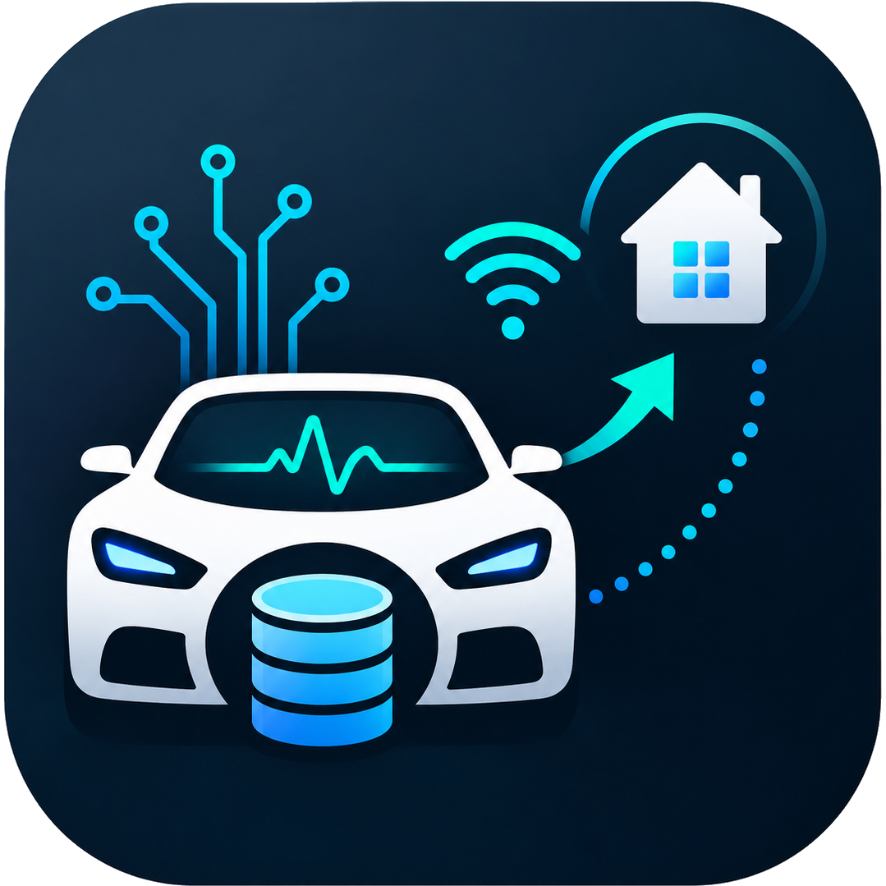
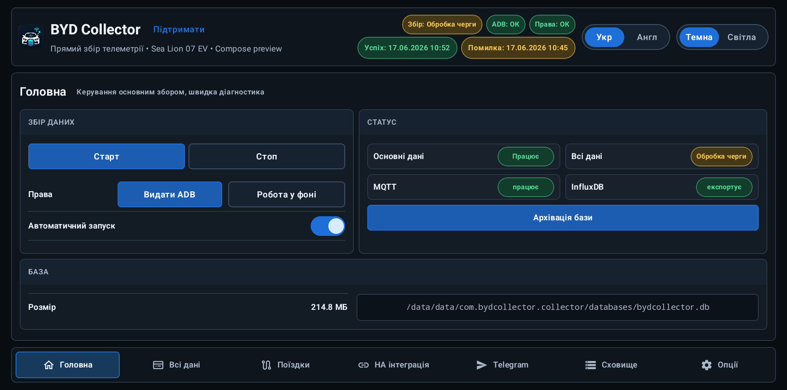
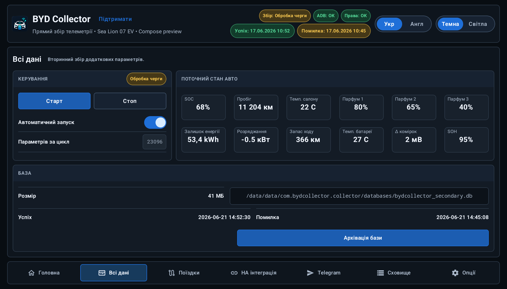
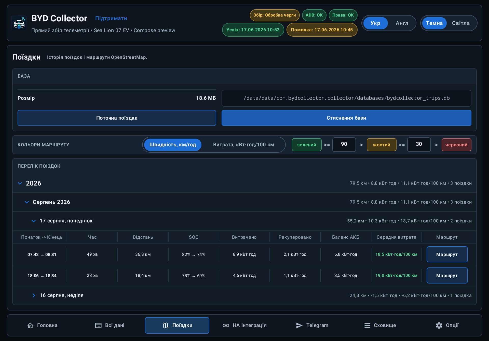
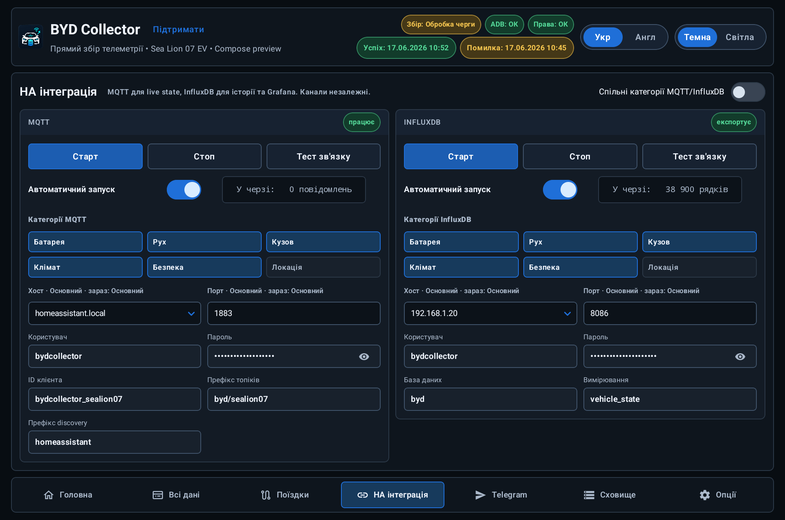
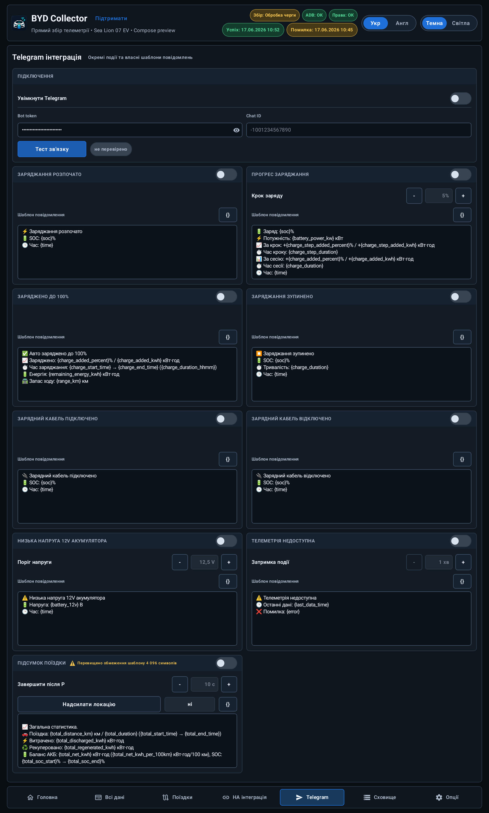
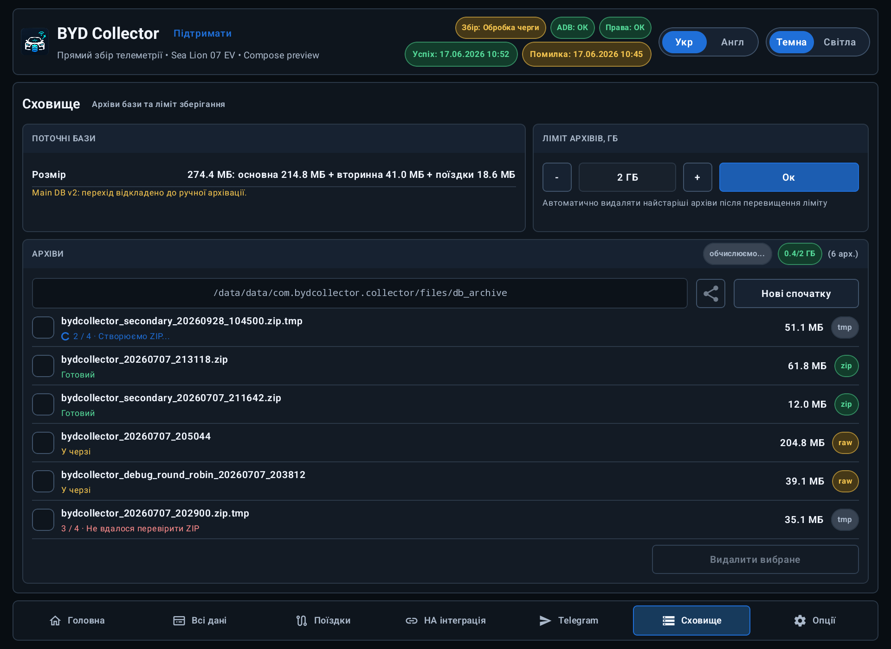
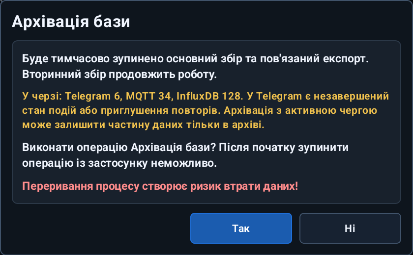
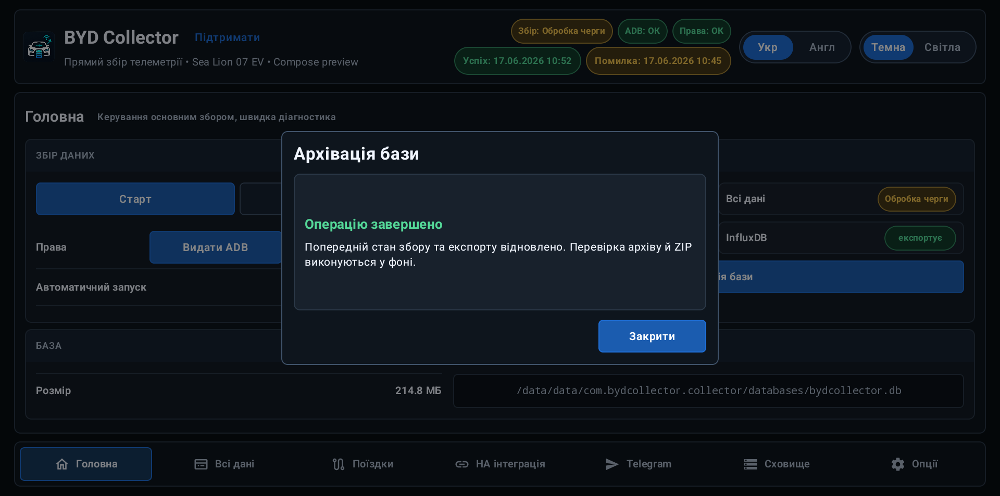
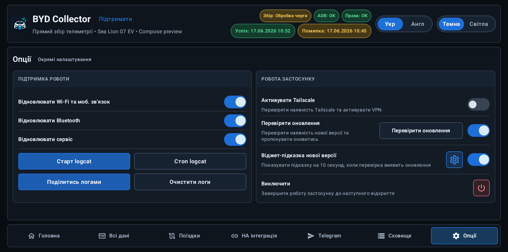

# BYD Collector

[English](README.md) | **Українська**



BYD Collector показує стан автомобіля, записує телеметрію та поїздки й може надсилати дані до Home Assistant, InfluxDB та Telegram. Дані зберігаються локально; зовнішні інтеграції необов'язкові.

**Доступ до автомобіля — лише для читання. Застосунок не надсилає команд керування автомобілем.**

- **Сумісність:** насамперед перевірено на BYD Sea Lion 07 EV 2025 китайського ринку з DiLink 5.0. Інші моделі та прошивки можуть надавати інші дані.
- **Завантаження:** [останній реліз на GitHub](https://github.com/sunlixWhyNotAvailable/byd-collector/releases/latest).
- **Допомога:** [Усунення проблем](#усунення-проблем) · [Повідомити про проблему](#повідомити-про-проблему) · [Приватність](PRIVACY.uk.md).
- **Донат:** [Підтримати проєкт переказом за номером картки](#підтримати-проєкт).

## Встановлення та перший запуск

Потрібні Android 8.0 або новіший, сумісна система DiLink, можливість встановлювати APK та локальний доступ ADB. ADB — це з'єднання Android, через яке застосунок читає дані автомобіля.

1. Завантажте APK зі сторінки релізу та звірте його контрольну суму SHA-256 з опублікованою, якщо вона є.
2. Встановіть і відкрийте **BYD Collector**, коли автомобіль припаркований.
3. Виконайте підказку щодо фонової роботи: у налаштуваннях DiLink встановіть `Disable background Apps -> BYD Collector` у `OFF`.
4. Підтвердьте запит Android на авторизацію ADB, коли він з'явиться. Для перевірки доступу натисніть `Видати ADB` у застосунку.
5. Дозвольте Android доступ до локації, якщо потрібні GPS-маршрути. Після відмови дозвіл можна надати в системних налаштуваннях.
6. Запустіть збір на вкладці `Головна` та перевірте його статус і показники. За бажанням увімкніть автоматичний запуск.
7. Налаштуйте лише потрібні інтеграції та перевірте кожне з'єднання перед використанням.

Без авторизації ADB нова телеметрія не збирається, але збережені дані й налаштування залишаються доступними. Після скидання планшета або оновлення прошивки може знадобитися повторна авторизація та відновлення дозволів на фонову роботу.

## Щоденне використання

Інтерфейс доступний українською та англійською мовами, у темній і світлій темах.

Скріншоти показують інтерфейс Preview із демонстраційними даними; значення та статуси наведені для прикладу.

### Основний збір і стан автомобіля

Використовуйте `Головна` для звичайного збору. Його кнопки запуску/зупинки та налаштування автостарту незалежні від вторинного збору.

- Картки стану показують заряд і стан здоров'я батареї, залишок енергії, запас ходу, пробіг, температури, заряджання та інші доступні показники.
- Картки можуть оновлюватися на увімкненому авто, навіть якщо обидва збори зупинені.
- Статус збору показує останній успіх і помилки. Відсутні чи невідомі значення не вважаються достовірними нулями.
- Телеметрія зберігається локально. Стежте за сховищем: активна історія автоматично не видаляється.
- Запас ходу в картках і Telegram є оцінкою на основі витрати, коли вона доступна, і може відрізнятися від штатного показника, який експортується до MQTT/InfluxDB.

<p align="center"></p>

### Вторинний збір — Всі дані

`Всі дані` записує ширший набір додаткових параметрів автомобіля в окрему базу. Це необов'язковий збір, переважно для діагностики або дослідження показників, яких немає в основному.

Запускайте та зупиняйте його незалежно. Він може займати значний обсяг сховища, тому зупиняйте його, коли він не потрібний, і за потреби архівуйте базу. Не всі параметри доступні або мають підтверджене значення на кожному автомобілі.

<p align="center"></p>

### Поїздки та маршрути

`Поїздки` показує сесії від увімкнення до вимкнення авто: дистанцію, час, інформацію про батарею та GPS-маршрути. Сесії без руху приховані зі звичайного списку.

- Відкрийте поїздку для перегляду метрик і маршруту або натисніть `Поточна поїздка` для активної сесії.
- Прапорець поточної поїздки позначає останню довірену координату. `Остання відома позиція` означає, що вона може вже не відповідати поточному місцю автомобіля.
- Маршрути показуються на OpenStreetMap із кольорами за швидкістю або витратою; пороги кольорів налаштовуються. Сірі ділянки витрати означають відсутність даних, а не нуль.
- Витрачена й рекуперована енергія та баланс АКБ показуються окремо. Середня витрата рахується за балансом і може бути від'ємною.
- Подавлення GPS, поганий прийом або відхилені стрибки координат можуть залишати розриви. Для мап потрібний інтернет.
- Стиснення маршрутів зменшує обсяг сховища без видалення поїздок чи точок. Це не видалення та не архівація бази.

<p align="center"></p>

## Необов'язкові інтеграції

### MQTT, Home Assistant та InfluxDB

Налаштуйте ці незалежні канали у вкладці `HA інтеграція`. Помилки з'єднання не зупиняють локальний збір.

| Канал | Призначення | Налаштування |
| --- | --- | --- |
| MQTT / Home Assistant | Поточний стан авто та автоматичне виявлення сутностей у Home Assistant | Хост/порт брокера, облікові дані за потреби, client ID, префікси топіків і discovery, категорії |
| InfluxDB v1 | Історія для графіків і Grafana | Хост/порт сервера, база, measurement, облікові дані за потреби, категорії |

1. Введіть налаштування сервера та виберіть категорії для надсилання.
2. За потреби налаштуйте альтернативну адресу **того самого сервера**, наприклад через VPN.
3. Натисніть `Тест зв'язку` для вибраного профілю, потім запустіть канал і за бажанням увімкніть його автостарт.
4. Перед редагуванням з'єднання зупиніть канал. Вибраний профіль і поточне з'єднання показуються окремо.

Експорт локації **за замовчуванням вимкнений** для кожного каналу й не залежить від локального запису маршрутів. Увімкніть його лише якщо хочете надсилати точні координати до цього отримувача.

MQTT передає поточний стан, тому під час відсутності зв'язку оновлення можуть бути пропущені. InfluxDB зберігає прогрес експорту та продовжує передачу історії після відновлення зв'язку; успішний тест не означає, що вся історія вже надіслана.

**Використовуйте довірену мережу або VPN. Поточні з'єднання MQTT та InfluxDB не шифруються через TLS.** Захищайте сервер і облікові дані; див. [Приватність](PRIVACY.uk.md).

<p align="center"></p>

### Telegram-повідомлення

Telegram необов'язковий і за замовчуванням вимкнений. Застосунок надсилає текстові повідомлення через вашого бота; він не приймає віддалених команд і не надсилає зображення маршрутів.

1. Введіть токен бота й chat ID у вкладці `Telegram`.
2. Натисніть `Тест зв'язку`.
3. Увімкніть потрібні події: початок/прогрес/повний заряд/завершення заряджання, підключення/відключення кабелю, низьку напругу 12 V, недоступну телеметрію або підсумки поїздок.
4. За потреби змініть затримки, пороги та шаблони повідомлень. Ваші власні шаблони зберігаються.

Підсумки поїздок можуть надсилатися після налаштованої затримки паркування в `P`. Після вимкнення авто застосунок намагається надіслати повідомлення одразу; час доставки все одно залежить від зв'язку. Звіт про заряджання охоплює лише частину, спостережену під час роботи збору.

`Надсилати локацію` за замовчуванням вимкнено. Увімкніть опцію та виберіть посилання Google, Waze, Apple та/або OSM, щоб отримувати локацію після вимкнення авто. Якщо підсумок поїздки вже надіслано, локація може прийти окремим повідомленням.

**Якщо GPS недоступний, посилання використовує останню довірену точку, яка може не збігатися з кінцевим місцем паркування.** Без довіреної точки посилання не надсилається.

Ненадіслані повідомлення зберігаються після перезапуску застосунку й архівації телеметрії; невдалі надсилання повторюються автоматично. Обсяг сховища обмежений, повідомлення не зберігаються безстроково. Очищення діагностичних логів не скасовує повідомлення, що очікують надсилання.

<p align="center"></p>

## Сховище та архіви

Телеметрія та поїздки зберігаються локально. `Сховище` показує розміри баз, наявні архіви та ліміт їхнього обсягу.

- **Архівувати основну базу:** натисніть `Архівація бази` на вкладці «Головна».
- **Архівувати вторинну базу:** натисніть `Архівація вторинної бази` на вкладці «Всі дані».
- **Поділитися наявним архівом або видалити його:** виберіть архів у «Сховище». Видалення потребує підтвердження.
- **Зменшити обсяг маршрутів:** скористайтеся стисненням у «Поїздки»; точки маршруту зберігаються.

Архівація зберігає вибрану базу та починає нову. Вона тимчасово призупиняє відповідний збір і пов'язаний експорт; інший збір продовжується. Прочитайте підтвердження й попередження про ненадіслані дані, забезпечте вільне місце та не переривайте операцію. Прогрес або помилка показуються біля архіву.

Ліміт архівів стосується готових архівів «Головна»/«Всі дані», **а не активних баз чи історії поїздок**. Автоматичне очищення видаляє старіші придатні до видалення архіви, захищаючи найновіший архів кожного типу. Основна історія та поїздки можуть продовжувати зростати.

<p align="center"></p>

<p align="center">
  <a href="docs/screenshots/uk/archive.png"></a>
  <a href="docs/screenshots/uk/archive-done.png"></a>
</p>

## Фонова робота та оновлення

В `Опціях` налаштуйте відновлення сервісу й за потреби відновлення Wi-Fi/мобільного зв'язку, Bluetooth або опційну активацію Tailscale. Ці функції відновлюють Android-сервіси та з'єднання, а не керують автомобілем. Доступ до сповіщень для відновлення сервісу не використовується для читання їхнього вмісту.

Перемикачі автостарту на вкладках збору й інтеграцій керують відповідними функціями. Натисніть `Виключити`, щоб зупинити роботу до наступного відкриття застосунку.

На сумісних прошивках збір може продовжуватись на вимкненому авто, але безперервний запис не гарантується. Android може завершувати процеси, а перезавантаження планшета перериває збір. Відновлення залежить від автомобіля та прошивки.

Перевірка оновлень може працювати у фоні й повторюватися після відновлення зв'язку. Для ручної перевірки відкрийте «Опції». Необов'язкова підказка оновлення показується поверх інших застосунків і потребує відповідного системного дозволу Android. Без нього звичайні пропозиції оновлення в застосунку та збір продовжують працювати.

<p align="center"></p>

## Усунення проблем

| Проблема | Що перевірити |
| --- | --- |
| Збір очікує ADB або показує помилку прав | Не вимикайте планшет під час перевірки, натисніть `Видати ADB`, підтвердьте системний запит і перевірте `Disable background Apps -> BYD Collector = OFF`. |
| Показник порожній, застарілий чи невідомий | Автомобіль може не надавати його або значення ще не підтверджене. Доступність залежить від моделі й прошивки. |
| Сховище швидко зростає | Зупиніть непотрібний вторинний збір, архівуйте відповідну базу та стисніть маршрути. Видалення старих архівів не зменшує активні бази. |
| MQTT/HA або InfluxDB не підключається | Перевірте вибрані хост/порт, облікові дані, категорії та мережу/VPN, потім протестуйте цей профіль. Альтернативна адреса не виправляє неправильні облікові дані. |
| InfluxDB відстає | Порівняйте прогрес експорту через певний час. Успішний тест підтверджує зв'язок, а не завершення експорту. |
| Telegram не надсилає повідомлення | Перевірте токен/chat ID тестом, перемикач події та мережу. Для локації також потрібні вибраний навігатор і довірена GPS-точка. |
| Архівація затримується або завершується помилкою | Прочитайте поточний етап/помилку й попередження, перевірте вільне місце та за можливості дочекайтеся обробки/експорту даних. Не переривайте активну архівацію. |

### Повідомити про проблему

1. Для відтворюваної проблеми почніть запис системних логів у `Опції -> Підтримка роботи`, відтворіть її, потім зупиніть запис. Потрібна авторизація ADB.
2. Натисніть `Поділитись логами`, щоб підготувати діагностичний ZIP і вибрати, куди його передати.
3. Відкрийте [форму повідомлення про помилку](https://github.com/sunlixWhyNotAvailable/byd-collector/issues/new?template=bug_report.yml). Додайте версію застосунку, модель/рік авто, версію DiLink/прошивки, приблизний місцевий час, очікувану й фактичну поведінку.

Діагностичний ZIP містить доступні логи застосунку/системи та діагностичні зведення, **але не бази телеметрії**. Якщо потрібна база, поділіться відповідним архівом окремо через «Сховище». Для створення ZIP потрібне додаткове вільне місце.

`Очистити логи` видаляє діагностичну історію та завершені записи після підтвердження. Це **не** видаляє бази телеметрії, архіви баз, поїздки чи ненадіслані повідомлення Telegram і не зупиняє активний запис системних логів.

**Переглядайте файли перед поширенням.** Розпізнані чутливі значення маскуються в діагностичних копіях, але повносистемні логи не гарантовано анонімні й можуть містити дані інших застосунків. Архіви баз можуть містити локацію та ідентифікатори авто. Надсилайте лише необхідне; не публікуйте токени чи паролі.

Телеметрія та логи не надсилаються розробнику автоматично. Зовнішні інтеграції — це вибрані вами отримувачі. Прочитайте повну [політику приватності](PRIVACY.uk.md).

Для інших звернень [запропонуйте покращення](https://github.com/sunlixWhyNotAvailable/byd-collector/issues/new?template=suggestion.yml) або скористайтеся [вибором форми звернення](https://github.com/sunlixWhyNotAvailable/byd-collector/issues/new/choose).

## Підтримати проєкт

Донати — це добровільна підтримка розробки та вдосконалення BYD Collector і застосунків для автомобілів BYD.

**Номер картки Банки — основний спосіб підтримки:**

```text
4874 1000 3354 3078
```

Скопіюйте номер і скористайтеся переказом на картку у своєму банку. Для цього способу застосунок mono не потрібен; доступність, ліміти та комісія залежать від вашого банку або платіжного сервісу. Перед підтвердженням перевірте дані отримувача.

<details>
<summary>Альтернатива: посилання на Банку mono та QR-код</summary>

[Відкрити Банку для підтримки](https://send.monobank.ua/jar/bKFV15i9e) або відсканувати QR-код:

<p><a href="https://send.monobank.ua/jar/bKFV15i9e"></a></p>

</details>

Ці самі реквізити доступні через `Підтримати` поруч із назвою застосунку. Донати необов'язкові; застосунок ніколи не здійснює платіж автоматично.

## Ліцензія

BYD Collector поширюється за ліцензією [GNU Affero General Public License v3.0](LICENSE). Це незалежний проєкт, не пов'язаний із BYD чи згаданими сервісами та не схвалений ними. Торговельні марки належать відповідним власникам.

Генеративні інструменти ШІ використовуються для розробки, тестування, аналізу діагностики та документації.

Використовуйте застосунок на власний ризик. Дані можуть бути неповними, затриманими чи помилковими; це не система безпеки або офіційний діагностичний засіб. Встановлюйте, налаштовуйте та діагностуйте лише на припаркованому авто.
